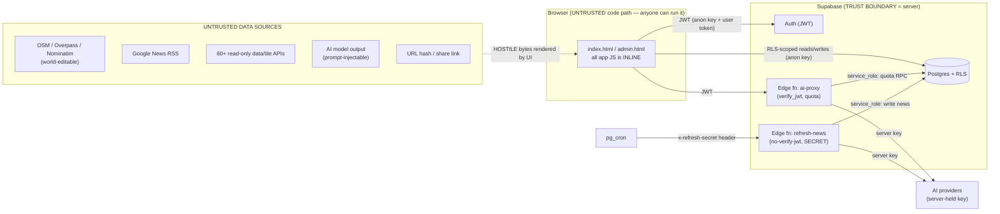

# IntMap — Security Architecture & Threat Model (#R138)

Authoritative description of IntMap's attack surface, trust boundaries, authentication /
authorization model, the public-vs-secret distinction, and the residual risks + manual
production settings. Companion to [`SECURITY.md`](../SECURITY.md) (reporting) and
[`SECURITY-TESTING.md`](SECURITY-TESTING.md) (how to run the checks). Keep this current when
the data flow, an Edge Function, or the auth model changes.

---

## 1. What we protect (assets)

| Asset | Where | Protected by |
|---|---|---|
| User account identity / session (JWT) | Supabase Auth; JWT in browser `localStorage` | Supabase Auth; **correct output-encoding** so XSS can't steal the token |
| Per-user private data (`favorites`, `user_prefs`, `donations`/`feedback`/`bug_reports` PII, `ai_usage`) | Postgres | **RLS** + column grants + SECURITY DEFINER RPCs |
| Admin capability + billing (`profiles.is_admin`/`is_pro`/`plan`/`email`) | Postgres | RLS (`is_admin()`) + column grant + **`tg_profiles_guard_privcols` BEFORE-UPDATE trigger** (grant-independent freeze, #R155) — no self-escalation of admin or billing plan |
| Provider API keys (AI, etc.) | Edge Function env (server only) | Never sent to the browser; never logged |
| AI spend / quota | `ai_usage` + `ai-proxy` | JWT-gated proxy + atomic RPC; refresh-news fail-closed secret |
| Integrity of what every visitor sees | `index.html` render paths | **XSS output-encoding** (`window.IntMapSafe`) + CSP |

**Adversaries considered:** an anonymous internet user; a *logged-in* user attacking other
users or the platform (the most important one — they hold a valid JWT and can write their own
rows via the Supabase REST API, bypassing the UI); and an attacker who can edit **third-party
data IntMap renders** (OpenStreetMap nodes, a news headline that reaches Google News RSS, a
Nominatim place name). All three are assumed hostile.

---

## 2. Trust boundaries & data flow

**The security rules that follow from this diagram:**
1. **Everything crossing into `UI` from `Untrusted` is hostile** and must be output-encoded
   before it touches the DOM (§4). The browser JS is not a trust boundary — an attacker can
   read and replay any request the page makes.
2. **Authorization lives on the server** (RLS, RPC EXECUTE grants, Edge-Function auth), never
   in the client UI. The admin console's client-side gate is UX only; the real boundary is
   RLS (proven by pgTAP).
3. **Secrets live only server-side** (Edge-Function env). The browser holds only the
   *publishable* anon key + the user's own JWT.

---

## 3. Authentication & authorization

- **AuthN:** Supabase Auth (email + Google/Apple OAuth). The session JWT is stored by the
  Supabase JS client in `localStorage` (its default; Supabase JS cannot use an httpOnly
  cookie). Consequence: **an XSS = token theft**, which is exactly why §4 is the priority.
- **AuthZ — data:** Postgres **Row Level Security** on every table + column-level UPDATE
  grants so a user can only touch their own rows and **cannot** set `is_admin`/`is_pro`/
  `plan`/`email` on their profile (no privilege escalation). See
  [`DATABASE.md`](DATABASE.md) / [`RLS-TESTING.md`](RLS-TESTING.md); enforced baseline in
  `supabase/migrations/20260718090000_baseline.sql`; attack cases in `supabase/tests/*_test.sql`.
  - **(#R144) RLS is the real protection — grants are wide open in prod.** Supabase's
    schema-wide default privileges grant `anon`/`authenticated` **full** table privileges on
    every `public` table (`relacl = {authenticated=arwdDxtm,…}`), so a *column-level* grant does
    **not** actually restrict a table that has a permissive RLS policy. Where a column must stay
    server-owned even though its row is user-editable (the Area-Monitors run-state + `next_run_at`),
    protection is a **BEFORE UPDATE trigger** (`tg_monitors_guard_state`), not the grant. Tables
    whose writes are meant to be service-role-only rely on RLS **default-deny** (no write policy) —
    that holds in prod regardless of grants. pgTAP now simulates the prod grant so tests catch this.
- **AuthZ — AI quota:** `ai_usage` is writable **only** by the SECURITY DEFINER RPCs
  `increment_ai_usage` / `refund_ai_usage`, whose EXECUTE is granted to `service_role` only.
  A user cannot inflate/deflate their own quota.
- **AuthZ — admin:** `profiles.is_admin`, checked by the `is_admin()` SECURITY DEFINER
  function (with `search_path=''`) inside the admin-only RLS policies. `admin.html`'s login
  gate is convenience; a non-admin who loads it still gets **zero** rows from RLS.

---

## 4. Frontend XSS defense (the primary control)

Because the app is a single inline no-build file and holds the session token in
`localStorage`, **correct output-encoding at every sink is the primary XSS defense** (CSP is
secondary — see §6). All untrusted text now routes through one canonical, dependency-free,
globally-defined helper, `window.IntMapSafe` (defined in the first `<head>` script):

- `IntMapSafe.html(s)` — escapes `& < > " '`; safe in HTML **text** and single/double-quoted
  **attribute** contexts.
- `IntMapSafe.url(s, {allowData})` — allows **only** `http(s)` / `mailto` / `tel` (+ raster
  `data:image`, never SVG); `javascript:` / `data:text/html` / `vbscript:` / tab-obfuscated
  schemes → `''`. For a URL in `href`/`src`/`style`, wrap as `html(url(s))` (scheme-check
  then quote-escape).

**Sinks hardened this round** (all were confirmed reachable from attacker-controlled data):

| Surface | Field(s) | Trigger |
|---|---|---|
| Community feed | `community_posts.img` → `` | auto-fires on feed render (most severe) |
| Community map pin | `title` / `body` tooltip | hover a malicious pin |
| Profile card | another user's `avatar_url` → `background:url()` | view attacker's profile |
| News | RSS `title` / `publisher` / `name` (6 sinks: card, translate re-render, 2 tooltips, mobile popup) | render / hover / tap |
| News links | article `link` → `window.open` | http(s)-only guard |
| Live-camera popup | OSM-editable `url` → iframe/video/img/`href` | open a malicious webcam |
| Place search card | Nominatim `display_name` / `type` / `country` | search → click a result |
| Earthquake / POI | USGS `place`, POI `url` | defense-in-depth |

The **Atlas AI reply** pipeline was audited and found **already safe** (it escapes before
markdown formatting and forces `https?:` on links) — unchanged. Bundled first-party GeoJSON
popups (ecoregions, volcanoes) are trusted-source and out of scope. **URL hash / share
restore, GeoJSON file import, and error rendering were audited and are safe** (hash values are
consumed as numbers/dates/layer-ids, imported properties only feed MapLibre paint layers,
error messages are escaped).

Regression guards: `tests/security.spec.js` proves the payloads stay inert in a real browser;
CodeQL runs the JS XSS queries.

---

## 5. Edge Functions & `service_role` usage

| Function | `verify_jwt` | Auth | Uses `service_role` for | Provider key |
|---|---|---|---|---|
| `ai-proxy` | **true** | Supabase JWT (login required) → 401 | plan lookup + `increment/refund_ai_usage` RPC | server env only, never logged |
| `refresh-news` | false (by design) | **fail-closed shared secret** (`x-refresh-secret` header, constant-time) | write `current_news`, read `geo_pins` | server env only |

- **`ai-proxy`** verifies the user, resolves plan → daily limit, **atomically** consumes one
  use, calls the provider with the server-held key, refunds on failure, and caps input
  (`MAX_PROMPT=24000`, `MAX_IMAGES=4`). Errors are typed; **prompt / key / JWT are never
  logged** (metadata only). CORS is `*` but that is safe: every request needs a valid user
  JWT that a cross-origin site cannot obtain.
- **`refresh-news`** (#R138) is **fail-closed**: `REFRESH_SECRET` **must** be set or every
  request is refused (503) — it never runs publicly. The secret is read **only** from the
  `x-refresh-secret` header (never a URL query, so it can't reach access logs) and compared in
  **constant time**. Only `POST` triggers a run. This closes the previous fail-open design
  where an unset secret let anyone trigger paid AI + `service_role` DB writes. `service_role`
  bypasses RLS, so it is confined to these two server functions and never reaches the browser.

---

## 6. Browser security — CSP & the GitHub Pages limits

IntMap is served by **GitHub Pages**, which **cannot set custom HTTP response headers**, and
its app JS is **entirely inline** with no build step and fetches from **60+ external hosts**.
So a nonce/hash `script-src` or a `connect-src` allowlist is impossible without a build the
project forbids, and would break the app. The chosen posture:

- **In-page CSP (`<meta http-equiv>`), tested to not break the app** — `object-src 'none'`
  (no plugin XSS), `base-uri 'self'` (no `<base>` hijack), `frame-src 'self' https: blob:`
  (blocks a `javascript:`/`data:` iframe), `worker-src 'self' blob:`, and a `script-src`
  allowlist (self + the known CDNs + `'unsafe-inline'`/`'unsafe-eval'`, which are unavoidable
  for an inline no-build app) that still blocks an injected `<script src=evil-host>`.
  `connect-src`/`img-src`/`style-src` are intentionally left unrestricted so the data/tile
  APIs keep working. `<meta name="referrer" content="strict-origin-when-cross-origin">`.
- **Because `'unsafe-inline'` is unavoidable, output-encoding (§4) — not CSP — is the primary
  XSS defense.** The CSP is defense-in-depth.
- **Header-only controls GitHub Pages cannot provide** — `X-Frame-Options` / CSP
  `frame-ancestors` (clickjacking), HSTS, `Permissions-Policy`, a header-form CSP. Documented
  here as a residual limitation. Mitigations: IntMap performs no sensitive state-changing
  action by click alone that clickjacking would meaningfully abuse; all `target="_blank"`
  links carry `rel="noopener"` and every `window.open` passes `noopener` (no reverse
  tabnabbing); GitHub Pages is HTTPS-only in practice. If the site is ever moved behind a host
  that can set headers (e.g. Cloudflare), add `frame-ancestors 'self'` / `X-Frame-Options:
  SAMEORIGIN` / HSTS there.

---

## 7. External data & privacy

IntMap calls **60+ public, read-only** third-party APIs (map/satellite tiles, elevation/
weather, routing, statistics, news, geocoding, market data, live cameras, AI providers). The
**full, user-facing list with exactly what is sent** is in the in-app Privacy Policy
(`index.html`, "第三者 / Third parties"). Security-relevant notes:

- Some camera-list endpoints and the Google News RSS feeds are fetched via **public CORS relays**
  (`corsproxy.io`, `allorigins.win`, `proxy.corsfix.com`, `codetabs.com`) — the relay sees the
  request; no personal data is sent. (#R214) `corsfix` was added because a relay that works is not
  a relay that works for every target: Google served the `en-US` news edition through `corsproxy.io`
  and answered the same proxy with its bot-block page for `ja-JP`.
- **No PII in URL query strings**; error monitoring (Sentry, dormant) strips PII / tokens /
  query strings and only reports IntMap's own exceptions.
- Analytics: Google Analytics (gtag) + Microsoft Clarity load as third-party scripts
  (allowlisted in the CSP).

---

## 8. Residual risks (accepted / tracked)

1. **`'unsafe-inline'`/`'unsafe-eval'` in `script-src`** — unavoidable for an inline no-build
   app; mitigated by output-encoding (§4). Eliminable only by a build step (out of scope).
2. **JWT in `localStorage`** — Supabase JS default; mitigated by the XSS fixes. An httpOnly
   cookie would need a different auth transport.
3. **Header-only browser controls** not settable on GitHub Pages (§6).
4. **Public CORS relays** for some camera lists (§7) — third-party sees the request.
5. **AI content-sharing**: when the active provider is OpenAI, submitted text/outputs may be
   used by OpenAI to improve its models (disclosed in-app); users are told not to submit
   sensitive data.
6. **The unwired in-app article reader** (`openArticleInSidebar`, no caller) uses a
   `sandbox="allow-scripts allow-same-origin"` iframe; `escForReader` now quote-escapes so its
   attribute sinks are safe, but if it is ever re-wired, drop `allow-same-origin`.

---

## 9. Manual production settings (operator — cannot be set from code)

These are **not** applied by this PR. Apply them in the GitHub / Supabase dashboards. **Never
put a real secret value in the repo, a PR, or a log.**

### GitHub (repo → Settings)
- **Code security**: enable **Secret scanning** + **Push protection**; enable **Private
  vulnerability reporting**; confirm **Dependabot alerts** (config already in
  `.github/dependabot.yml`); **CodeQL** runs from `security.yml` (free for this public repo).
- **Branch protection / ruleset on `main`**: require PRs; require status checks **CI** (static
  + browser) and **Database checks** (and optionally **Security / CodeQL**) to pass; no direct
  pushes; keep **Actions default permissions = read** (workflows already set least privilege).

### Supabase (project `vpekfwdpurzejrrmacac`)
- **`refresh-news` — REQUIRED (this PR makes it fail-closed):**
  1. `supabase secrets set REFRESH_SECRET=<a long random value>` (do not paste the value
     anywhere in the repo).
  2. Update the pg_cron job to send the **header** `x-refresh-secret: <REFRESH_SECRET>` when it
     POSTs the function (header only — never `?secret=` in the URL). Example net.http_post
     call shape (secret injected from a secure setting, not literal):
     `select net.http_post(url:='https://<ref>.functions.supabase.co/refresh-news',
      headers:=jsonb_build_object('Content-Type','application/json','x-refresh-secret', current_setting('app.refresh_secret')));`
  3. Redeploy: `supabase functions deploy refresh-news --no-verify-jwt` (maintainer, gated).
     Until the secret is set + cron updated, news refresh is intentionally **off** (fail-safe).
- **Auth → URL Configuration**: confirm the production **Site URL** and **Redirect URLs** are
  the real production origins only (no wildcard, no stray localhost) to prevent open-redirect
  on OAuth. The R155 **password-reset** and **email-change** flows email a link back to
  `location.origin + location.pathname`, so that exact URL (`https://rwmqx7dwb5-arch.github.io/IntMap/`)
  MUST be in the Redirect URLs list or those links will bounce.
- **Auth → Passwords (#R155) — REQUIRED for the breached-password guarantee:** enable
  **"Leaked password protection"** (HIBP, server-side) and set **Minimum password length = 8**
  with the character requirement matching `supabase/config.toml` (`lower_upper_letters_digits`).
  The client mirrors this + runs its own HIBP k-anonymity check, but the dashboard toggle is the
  authoritative server-side guard and is NOT reproducible from the repo.
- **Auth → Passkeys / WebAuthn (#R155) — REQUIRED for passkeys to work:** configure the
  **Relying Party ID = `rwmqx7dwb5-arch.github.io`** (the bare host; `github.io` is on the public
  suffix list so the full host must be used) and add the **Relying Party Origin
  `https://rwmqx7dwb5-arch.github.io`**, then enable passkeys. Until this is set, the client's
  passkey buttons degrade gracefully to password auth (feature-detected). supabase-js ≥ 2.105 is
  required (the app loads the latest `@supabase/supabase-js@2` from the CDN, which satisfies it).
- **Auth → SMTP**: for reliable delivery of confirmation / reset / email-change mails at volume,
  configure a custom SMTP sender (the default Supabase mailer is rate-limited). Optional but
  recommended once real users exist.
- **Auth → Bot protection (CAPTCHA)**: optionally enable hCaptcha/Turnstile on signup + password
  reset to blunt automated abuse of those public endpoints (the client already sends no data that
  would leak, and the flows are enumeration-safe).
- **Postgres version**: confirm `supabase/config.toml` `db.major_version` matches production
  (for faithful `db diff`).
- **Migrations**: apply `20260720120000_security_hardening.sql` **and `20260722100000_security_r155.sql`**
  via the gated flow in [`MIGRATIONS.md`](MIGRATIONS.md) (both are additive/idempotent; the R155
  length caps are `NOT VALID`, safe against a pre-existing oversized row). **R155 was already
  applied to production on 2026-07-22 via the Management API** and verified (profiles PII leak +
  is_pro/plan escalation closed) — re-applying is a no-op.
- **`delete-account` Edge Function (#R155)**: deployed with `verify_jwt` on
  (`supabase functions deploy delete-account`). No secrets beyond the injected service-role key.
- **Backups**: register the backup secrets so `db-backup.yml` can run (see
  [`BACKUP-RESTORE.md`](BACKUP-RESTORE.md)).

---

## 11. R155 — auth hardening, DB reconciliation & account lifecycle

Prod had **drifted** from the migration files; a live audit (`supabase db query --linked`,
2026-07-22) found the reconstructed baseline overstated how locked-down production was. Two
**live criticals**, both on `profiles`, plus a full auth-lifecycle build-out:

### 11.1 The two production criticals (found + fixed + verified same day)
- **PII leak (critical).** `profiles` carried **two** redundant `SELECT … USING (true)` RLS
  policies granted to the `public` role. RLS ORs policies, so these overrode the intended
  own-or-admin policy: **any anon/authenticated caller could read every user's `email`,
  `is_admin`, `is_pro`, `plan`** via the public anon key. Fixed by dropping both permissive
  policies and adding the `profiles_public` view (id/display_name/bio/avatar_url only) — which
  the client already reads first (`imViewProfile`, #R134).
- **Privilege / billing escalation (high).** Supabase's schema-wide DEFAULT PRIVILEGES grant
  every role a blanket table-level `UPDATE` on every public table, and profiles' UPDATE policy
  is row-only (no column filter). A pre-existing `guard_admin_flag` trigger froze `is_admin`
  specifically, so admin self-promotion was defended-in-fact — **but it left `is_pro`/`plan`
  unguarded**, so a user could `update profiles set plan='unlimited'` to grant themselves the
  paid AI quota / raised monitor cap. Fixed by revoking the table-level UPDATE (column grant
  only) **and** adding `tg_profiles_guard_privcols` — a grant-independent BEFORE UPDATE trigger
  that freezes `is_admin`/`is_pro`/`plan`/`email` for any non-`service_role` caller (the R144
  pattern applied to profiles), which supersedes and replaces the narrow `guard_admin_flag`.

### 11.2 Least-privilege reconciliation (`20260722100000_security_r155.sql`)
Revoked the default `ALL` from `anon`/`authenticated` on **every** public table and re-granted
only the baseline's intended minimal set — including the monitor child tables (`monitor_runs`/
`_evidence`/`_reports`), which R144 had missed, so "run results cannot be forged" now holds at
the grant layer too, not just via RLS. Added `NOT VALID` length caps on the anon/user-insertable
text (`feedback`/`bug_reports`/`community_*`) as an abuse/DoS guard. The prod-only `rls_auto_enable`
event trigger (auto-enables RLS on any new public table — a good fail-closed default) was kept.
Proven by **pgTAP `05_r155_security_test.sql`**, which reproduces the prod condition on CI (grants
`authenticated` the blanket UPDATE) and asserts the guard trigger still blocks escalation — the
one thing vanilla CI could not otherwise reproduce.

### 11.3 Account lifecycle & auth hardening (client + Edge Function)
- **Account deletion (real, not logout):** `delete-account` Edge Function — JWT-gated,
  `confirm:"DELETE"` required, explicit owned-row purge across every user-owned table, then
  `auth.admin.deleteUser`. The account menu has a type-your-email confirmation.
- **Passkeys (WebAuthn):** `supabase-js` `experimental.passkey` — sign-in on the login modal,
  enroll/list/remove in the account Security section. Feature-detected (`browserSupportsWebAuthn`
  + method presence) with graceful password fallback.
- **Password reset / change, email change, log-out-all-devices:** `resetPasswordForEmail` +
  `PASSWORD_RECOVERY` → a strength-and-breach-gated set-password modal; `updateUser({password})`
  / `updateUser({email})`; `signOut({scope:'global'})`.
- **Weak/breached password rejection:** client strength gate (8+, lower/upper/digit — mirrors the
  `config.toml` server floor) **and** a Have-I-Been-Pwned k-anonymity check (only the first 5 hex
  of the SHA-1 leaves the device; fail-open so an HIBP outage never blocks a real signup). The
  dashboard's server-side leaked-password protection (§9) is the authoritative backstop.
- **Account-enumeration safety:** identical signup message whether or not the email exists; a
  single generic "invalid email or password"; enumeration-safe reset wording. Same in `admin.html`.
- **Token-leak prevention:** GA `page_location`/`page_referrer` are sanitized to strip
  `code`/`access_token`/`refresh_token`/`token_hash`; OAuth + reset `redirectTo` are origin+path
  only; `referrer` meta is `strict-origin-when-cross-origin`.

### 11.4 Admin console isolation (`admin.html`)
Removed the public **Sign Up** (admins are DB-provisioned; the real boundary is RLS/RPC + the
profiles guard trigger, so a non-admin who signs in is bounced by `gate()`). Added a **strict CSP**
(`connect-src` locked to self + `*.supabase.co`; `object-src 'none'`; `base-uri`/`form-action 'self'`),
hardened the local escaper to also escape the single quote, added a `safeUrl()` scheme allow-list,
and a **re-authentication ("sudo") gate** before the destructive starter-dataset import. Behavioural
XSS tests for `esc()`/`safeUrl()` live in `tests/r155-checks.test.mjs`.

---

## 10. Reporting
See [`SECURITY.md`](../SECURITY.md).
