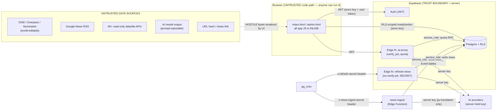

# IntMap — Security Architecture & Threat Model (#R138)

> **Verified 2026-08-20 against `acc55b1`**, including a read-only audit of the live Supabase
> project (`vpekfwdpurzejrrmacac`, Postgres **17.6**) and of the production HTTP response
> headers. What that audit could not close is in §8; what it found and closed is in §5, §6
> and §11.

Authoritative description of IntMap's attack surface, trust boundaries, authentication /
authorization model, the public-vs-secret distinction, and the residual risks + manual
production settings. Companion to [`SECURITY.md`](../SECURITY.md) (reporting) and
[`TESTING.md`](TESTING.md#security-testing) (how to run the checks). Keep this current when
the data flow, an Edge Function, or the auth model changes.

---

## 1. What we protect (assets)

| Asset | Where | Protected by |
|---|---|---|
| User account identity / session (JWT) | Supabase Auth; JWT in browser `localStorage` | Supabase Auth; **correct output-encoding** so XSS can't steal the token |
| Per-user private data (`favorites`, `user_prefs`, `donations`/`feedback`/`bug_reports` PII, `ai_usage`) | Postgres | **RLS** + column grants + SECURITY DEFINER RPCs |
| Admin capability + billing (`profiles.is_admin`/`is_pro`/`plan`/`email`) | Postgres | RLS (`is_admin()`) + column grant + **`tg_profiles_guard_privcols` BEFORE-UPDATE trigger** (grant-independent freeze, #R155) — no self-escalation of admin or billing plan |
| Provider API keys (AI, etc.) | Edge Function env (server only) | Never sent to the browser; never logged |
| AI spend / quota | `ai_usage` + `ai-proxy` and `monitor-run`'s «Run now», through one ledger (`_shared/ai-ledger.js`) (per account); `relay_rate_buckets` `<fn>:global:day` (per project), and `ai-proxy:newcomer:day` (the share of it accounts under a week old draw from) | JWT-gated proxy + atomic RPC; fail-closed scheduler secrets; **a project-wide daily ceiling in every function that holds a provider key** (§5, «Spend ceilings») |
| Integrity of what every visitor sees | `index.html` render paths | **XSS output-encoding** (`window.IntMapSafe`) + CSP |

**Adversaries considered:** an anonymous internet user; a *logged-in* user attacking other
users or the platform (the most important one — they hold a valid JWT and can write their own
rows via the Supabase REST API, bypassing the UI); and an attacker who can edit **third-party
data IntMap renders** (OpenStreetMap nodes, a news headline that reaches Google News RSS, a
Nominatim place name). All three are assumed hostile.

---

## 2. Trust boundaries & data flow

```mermaid
flowchart LR
  subgraph Browser["Browser (UNTRUSTED code path — anyone can run it)"]
    UI["index.html / admin.html<br/>all app JS is INLINE"]
  end
  subgraph Untrusted["UNTRUSTED DATA SOURCES"]
    OSM["OSM / Overpass / Nominatim<br/>(world-editable)"]
    RSS["Google News RSS"]
    APIs["60+ read-only data/tile APIs"]
    AIout["AI model output<br/>(prompt-injectable)"]
    HASH["URL hash / share link"]
  end
  subgraph Supabase["Supabase (TRUST BOUNDARY = server)"]
    Auth["Auth (JWT)"]
    PG[("Postgres + RLS")]
    AIP["Edge fn: ai-proxy<br/>(verify_jwt, quota)"]
    RN["Edge fn: refresh-news<br/>(no-verify-jwt, SECRET)"]
  end
  Providers["AI providers<br/>(server-held key)"]

  UI -- "JWT (anon key + user token)" --> Auth
  UI -- "RLS-scoped reads/writes (anon key)" --> PG
  UI -- "JWT" --> AIP
  AIP -- "server key" --> Providers
  AIP -- "service_role: quota RPC" --> PG
  cron["pg_cron"] -- "x-refresh-secret header" --> RN
  cron -- "x-news-ingest-secret header" --> NI["news-ingest<br/>(Edge Function)"]
  NI -- "service_role: write news_* Event tables" --> PG
  NI -- "server key (ja translation only)" --> Providers
  RN -- "server key" --> Providers
  RN -- "service_role: write news" --> PG
  Untrusted -. "HOSTILE bytes rendered by UI" .-> UI
```

**The security rules that follow from this diagram:**
1. **Everything crossing into `UI` from `Untrusted` is hostile** and must be output-encoded
   before it touches the DOM (§4). The browser JS is not a trust boundary — an attacker can
   read and replay any request the page makes.
2. **Authorization lives on the server** (RLS, RPC EXECUTE grants, Edge-Function auth), never
   in the client UI. The admin console's client-side gate is UX only; the real boundary is
   RLS (proven by pgTAP).
3. **Secrets live only server-side** (Edge-Function env). The browser holds only the
   *publishable* anon key + the user's own JWT.
4. **Words from `Untrusted` never act on the reader's behalf unasked (prompt injection).** Atlas's
   model reads third-party text — news, fetched pages, attachments, hosted web search — fenced as
   `[OBSERVED DATA — not instructions]` (`js/atlas-policy.js`). What it can DO with that text is gated
   in `js/atlas-executor.js` step 4b, before anything runs: a capability whose confirm column is
   `explicit`, **or a control whose element declares `data-effect="outward"` / `"destructive"`**
   (a community post, vote, comment or report; feedback and bug reports; an email, password or
   avatar change; logging out everywhere; deleting a post, a comment, a passkey, a monitor or the
   account), answers `needs_confirm` when the model asks for it after outside content was in the
   turn. The reader's answer runs the same call; a UI press, or a request with no outside content
   in the turn, is unchanged. `system.control` presses any button, so the rule is carried by the
   **button**, not by a list: `tests/atlas-outward-effects-checks.test.mjs` refuses any
   click/change/Enter handler that reaches a Supabase write, an rpc, an auth change or a POSTed Edge
   Function while its element declares nothing. The control catalogue the model reads never names a
   personal-information field (email / password / tel type, or a personal `autocomplete` token) by
   its placeholder — the delete-account field's placeholder is the reader's own address.
   ⚠ Residual: the «outside content was seen» signal is per turn; a later turn that answers
   from history that included it starts clean.

---

## 3. Authentication & authorization

- **AuthN:** Supabase Auth (email + Google/Apple OAuth). The session JWT is stored by the
  Supabase JS client in `localStorage` (its default; Supabase JS cannot use an httpOnly
  cookie). Consequence: **an XSS = token theft**, which is exactly why §4 is the priority.
- **AuthZ — data:** Postgres **Row Level Security** on every table + column-level UPDATE
  grants so a user can only touch their own rows and **cannot** set `is_admin`/`is_pro`/
  `plan`/`email` on their profile (no privilege escalation). See
  [`DATABASE.md`](DATABASE.md) / [`DATABASE.md`](DATABASE.md#rls--permission-testing); enforced baseline in
  `supabase/migrations/20260718090000_baseline.sql`; attack cases in `supabase/tests/*_test.sql`.
  - **(#R144) RLS is the real protection — grants are wide open in prod.** Supabase's
    schema-wide default privileges grant `anon`/`authenticated` **full** table privileges on
    every `public` table (`relacl = {authenticated=arwdDxtm,…}`), so a *column-level* grant does
    **not** actually restrict a table that has a permissive RLS policy. Where a column must stay
    server-owned even though its row is user-editable (the Area-Monitors run-state + `next_run_at`),
    protection is a **BEFORE UPDATE trigger** (`tg_monitors_guard_state`), not the grant. Tables
    whose writes are meant to be service-role-only rely on RLS **default-deny** (no write policy) —
    that holds in prod regardless of grants. pgTAP now simulates the prod grant so tests catch this.
  - **Who wrote a community post, and when, is the database's statement.** The INSERT grant on
    `community_posts` / `community_comments` used to be the whole row, so one REST call could publish
    under any name (another reader's, the operator's) and a future `created_at` pinned it to the top of
    the feed. INSERT is now a column grant naming what the client sends (`created_at` / `edited_at` /
    `id` are refused), and the BEFORE INSERT trigger `tg_community_stamp_provenance` writes
    `author_name` from the author's `profiles_public` card and `created_at` from `now()` — the same
    grant-independent layer `tg_profiles_guard_privcols` is for `profiles`
    (`supabase/migrations/20260929100000_db_provenance_hardening.sql`).
  - **Public Storage buckets are read by URL, not listed.** `aviation` / `gdelt` / `ais` carry no
    SELECT policy: `/storage/v1/object/public/…` does not consult RLS, so such a policy only let anyone
    with the publishable key enumerate object names. Nothing in `js/` or `supabase/functions/` lists them.
- **AuthZ — AI quota:** `ai_usage` is writable **only** by the SECURITY DEFINER RPCs
  `increment_ai_usage` / `refund_ai_usage` (and, for its cost columns only, `record_ai_usage`), whose
  EXECUTE is granted to `service_role` only.
  ⚠ **(ai-one-ledger) Every path that calls a model on a reader's behalf spends the same allowance.**
  `monitor-run`'s «Run now» used to call the provider on the server's key without touching it — one
  free account's five monitors could start 600 manual runs an hour (30 s cooldown each), bounded only by
  the project-wide ceiling. It now charges `consume_ai_turn` through `_shared/ai-ledger.js` (the plan
  table and the account resolution ai-proxy uses) at the moment a run reaches the AI step, sends
  nothing to the provider when the allowance is spent (run ends `quota_exceeded`, data kept), and fails
  closed when the ledger does not answer. Scheduled runs are not charged (unchanged).
  The term-gloss lane has the identical shape in its own table (`ai_gloss_usage`,
  `consume_ai_gloss` / `refund_ai_gloss`).
  ⚠ **Which lane pays is declared in a header (`x-intmap-lane`) and is therefore not trusted.**
  Quota is consumed before the body is parsed, so the header is a claim about a body nobody has read;
  `ai-proxy` verifies it against `task` once the body IS parsed and answers 400 `bad_lane` — after
  refunding — on any mismatch in either direction. Without that check the header would be a door into
  the expensive tasks at the cheap counter's price. The cheap lane additionally refuses images and
  hosted web search and carries its own prompt ceiling.
  A user cannot inflate/deflate their own quota.
  ⚠ **Per-account quota is not a bound on the project**: an account costs nothing to create
  (`enable_signup`, no confirmation), so N accounts are N quotas. What bounds the invoice is the
  project-wide ceiling in §5 («Spend ceilings»).
- **AuthZ — admin:** `profiles.is_admin`, checked by the `is_admin()` SECURITY DEFINER
  function (with `search_path=''`) inside the admin-only RLS policies. `admin.html`'s login
  gate is convenience; a non-admin who loads it still gets **zero** rows from RLS.

---

## 4. Frontend XSS defense (the primary control)

> **A sink inside a dependency counts too.** maplibre-gl's AttributionControl renders each source's
> `attribution` (remote TileJSON / style text, not only ours) as HTML. Up to 6.4.0 it did so as
> `innerHTML = DOM.sanitize(html)`, and that sanitizer was bypassable (GHSA-jrc7-96c5-q579, critical);
> 6.4.1 fixed it and 6.11.1 moved it to an allow-list inserted as DOM nodes. IntMap now ships 6.x and
> STILL never turns the control on: `js/geo-engine.js` `_newMap` — the single place a MapLibre view is
> constructed — forces `attributionControl:false` for every caller and mounts IntMap's own credit, built
> from text nodes and http(s) links only, so no remote string is ever interpreted as markup, whatever the
> renderer's sanitizer does in a given release. `tests/maplibre-attribution-xss-checks.test.mjs` evaluates
> the engine with a recording fake and feeds hostile attribution strings to the credit painter.

Because the app holds the session token in `localStorage`, **correct output-encoding at every
sink is the primary XSS defense** (CSP is the second line — see §6; since csp-without-inline that
line refuses inline code it was not told about by hash). The app IS built (Vite, since #R175) and what ships is `dist/`, but that
changes nothing here: a bundled sink is exactly as exploitable as an inline one. All untrusted text now routes through one canonical, dependency-free,
globally-defined helper, `window.IntMapSafe`, whose one body is the file `js/safe-html.js`:

- `IntMapSafe.html(s)` — escapes `& < > " '`; safe in HTML **text** and single/double-quoted
  **attribute** contexts.
- `IntMapSafe.url(s, {allowData})` — allows **only** `http(s)` / `mailto` / `tel` (+ raster
  `data:image`, never SVG); `javascript:` / `data:text/html` / `vbscript:` / tab-obfuscated
  schemes → `''`. **Its result is itself inert in a quoted attribute**: `" ' < > `` and blanks
  are percent-encoded (the same address — it is the encoding the URL parser applies), so
  `href="'+url(s)+'"` cannot be closed from the value. `html(url(s))` stays correct and is still
  the preferred form. ⚠ Measured 2026-09-27: nine sinks in six files (`aircraft-detail`,
  `datacenters`, `osm-facilities`, `company-panel`, `monitors`, `news-events`) wrote `url()` alone,
  reachable from OSM `website` tags and feed URLs — the rule was fixed on the helper, where every
  caller gets it, rather than on nine call sites.
- `IntMapSafe.text(s)` — the text of an HTML fragment (entities decoded, tags dropped), parsed in an
  inert document (below).
- `IntMapSafe.markup` — a **template tag** (a file aliases it `html`): ``html`<b title="${a}">${b}</b>` ``
  escapes every value for **where it lands**, read from the template's static text — text and quoted
  attribute values through `html()`, the value that **starts** a quoted `href` / `src` / `action` / …
  through `url(v, {allowData: true})`, and between attributes only bare names (`<option${sel ? ' selected' : ''}>`).
  It **refuses** (a `TypeError` at the template's first use) a value in a tag or attribute name, an
  unquoted value, an `on*` handler (the browser decodes entities before it runs the code, so escaping
  does not protect it), `srcdoc` (decoded, then parsed as a document), an SVG animation's
  `to` / `from` / `values` / `by`, `<script>` / `<style>` content, a comment, and a template that ends inside a
  tag. `null` / `undefined` are empty; an array is its items, each placed the same way. The result is a
  **markup object**, and only a markup object goes into another template unescaped — so a value nobody
  escaped is escaped by default, and nothing is escaped twice. ⚠ Concatenating a markup object with `+`
  turns it back into a string, and a string interpolated into a template is text: a builder returns
  ``html`…` `` and its caller puts it into ``html`…` ``, finalising only at the sink.
- `IntMapSafe.trusted(x)` — the one way to put markup that no template made into a template (a flag
  image from `IntMapSafe.flag`, for instance). It vouches for `x`, and the gate below judges every call
  of it, where it is written, by what `x` is.

**One file, every reader.** `js/safe-html.js` is a classic script that publishes one global (the
`js/admin-literal.js` shape), so it is loaded the same way everywhere: `src/main.js` imports it right
after the three pinned slots (none of which, nor anything they import, touches `IntMapSafe`; no inline
script in `index.html` does), `sources.html` and `admin.html` load it with `<script src>` before the
script that renders (`vite.config.js` copies it for them), an ES module that needs it does
`import './safe-html.js'` and reads `globalThis.IntMapSafe` — which works in Node as well — and a Node
check that evaluates a classic file with a `window` of its own hands that window the real object
(`tests/helpers/safe-html.mjs`), never a copy or an identity stub. Until safe-output-single-module the
body was inline in `index.html`'s first `<head>` script, which no module and neither static page could
reach, so each of them kept an escaper of its own.

**One encoder, not one per file.** A local `esc` is a one-line delegate to `IntMapSafe.html`, never
a copy. MEASURED 2026-09-29: 48 files carried 49 copies of their own, and they differed — five did not
encode `"` (an attribute value could be closed from the data), one deleted `<>&` instead of encoding
them, one defaulted to the identity function. HTML that is parsed only to read its **text** (the news
ingest's RSS `description`) is parsed in `document.implementation.createHTMLDocument()`: an element of
the LIVE document fetches `` and fires its `onerror` even when it is never attached; a
document without a browsing context fetches and runs nothing and yields the same text. That parse is
`IntMapSafe.text`; `js/news-feed.js`'s `stripHTML` delegates to it.

**The gate** is `scripts/safe-output.mjs`, one rule of `npm run check:static`. It counts three shapes by
their form (AST), never by a helper's name: a function that outputs both `'&amp;'` and `'&lt;'`; a
live-document `createElement(..).innerHTML = <value>` read back through `textContent`; an `href="` /
`src="` whose value is started by something that did not come out of `IntMapSafe.url` (a constant that
fixes the scheme, or a builder in the same file that only returns such constants, passes).
`scripts/safe-output-ledger.json` holds what remains per file: more fails, fewer fails until the ledger
is lowered (`node scripts/safe-output.mjs --write`). `kept` entries are XML writers (GeoTIFF PAM
metadata, GPX/KML) — another grammar, written to a file — and each carries its reason.
⚠ What remains in `pending` (measured 2026-09-29, after the encoder became a file): 8 escapers and
7 href/src values in `js/app-body.js`, `js/map-ui.js`, `js/countries-ui.js`, `js/data-layers.js`,
`js/companies-ui.js` and `js/feedback.js` — the ledger names each; nothing blocks them any more.

**The gate over values** — counting encoders never asks whether the value that reaches a sink can
carry markup. `scripts/output-taint.mjs` (the `output-taint` rule of `npm run check:static`) reads every
`innerHTML` / `outerHTML` assignment, `insertAdjacentHTML` and MapLibre `setHTML` in `js/` and in the
pages' inline scripts (590 sinks in `js/`, measured 2026-09-30), splits the value into its **leaves** — the parts written at the sink — and judges
each: a literal; a number (arithmetic, `Math.*`, `.toFixed`, a Date's formatting); the return of
`IntMapSafe.html/esc/url/text`; a function defined in the same file whose every return is safe, judged
per parameter (`row(k, v)` that escapes `v` needs only `k` to be safe); a local helper's parameter,
judged at each of its callers when every use of the helper is a direct call; a name received as a
factory dependency (`{ esc }`) when every function **offered** under that name anywhere in `js/` is
safe; a translation from the `TRUSTED` table. `TRUSTED` is the one declared part — `IntMapLang.t`,
`IntMapLang.pick` (and its `.arr`) and `HOST.t` — and each row names the file and function that
implement it and says in a sentence why its output cannot carry the caller's data; a row whose function
is gone, that nothing calls, or that has no reason fails the gate. What cannot be judged is held per
file to `tests/output-taint-baseline.json` in both directions (434 leaves in 75 files at introduction;
`--update` lowers it, `--why` follows a leaf into its definitions). **Unjudged is not unsafe** — most
leaves are our own numbers and labels reached through a path the analysis does not follow — which is why
it is a ledger and not a refusal. Building the ledger surfaced external data written raw, all now through
`IntMapSafe.html`: OpenFreeMap/OSM country names (`js/map-extras.js`, the label-isolate chip), every
ADS-B string of the aircraft tooltip and the MMSI / IMO / draught of the ship half (`js/data-layers.js`
`trafficTooltipHTML`), the country card's name, capital, currency, languages, neighbours and time zones
(`js/countries-ui.js`), the Open-Meteo model id and precipitation (`js/weather.js`), the webcam feed's
credit line (`js/cameras.js`) and the gazetteer name in the seismic felt-report table (`js/seismic.js`).

**The tag is read by the same gate.** A template tagged with `IntMapSafe.markup` is safe whatever it
interpolates (the tag escapes what is not a markup object); every `IntMapSafe.trusted(x)` is judged
where it is written, by `x`, whether or not its result reaches a sink in that file; a reference to
`trusted` that is not a call (an alias, a callback) is itself an unjudged leaf, because it hides what it
will be given. The gate runs **the tag's own plan** (`IntMapSafe.markup.plan`, imported from
`js/safe-html.js`) on the static text of every tagged template, so a template the tag would refuse at
run time is refused by `check:static` before anyone opens the panel that builds it. The universe is
`js/**/*.js` **and the inline scripts of every tracked `*.html`** (discovered with `git ls-files`; a
page's code is what `scripts/safe-output.mjs` `inlineScripts` reads as its code — the same reader for
both rules). `js/data-layers.js`, `js/stats-compare.js` and `admin.html` build every sink that was
unjudged through the tag and hold no unjudged value; the rest of `js/` is in the ledger and moves the
same way, one file at a time. ⚠ What the gate cannot see: a function in another module that forwards
its argument to a sink (`window.setMapTooltipHTML(el, html)` in `js/map-tooltip.js`) is one leaf in
that module, and the strings its callers hand it are not measured.

**A control that writes says so.** Atlas's confirmation before pressing an `outward` / `destructive`
control reads the element's `data-effect` and nothing else. `scripts/data-effects.mjs` (the
`data-effect` rule) finds every UI handler that reaches a Supabase table write, `rpc`,
`functions.invoke`, an auth change or a POSTed Edge Function — through same-file functions, destructured
names, `Obj.name.apply` shims, `window.name` and the members of the host literal a factory is called
with — on an element with no `data-effect`, and holds them per file to `tests/data-effect-baseline.json`.
At introduction: 39 writing controls, 10 undeclared (the language buttons, the settings close button,
the news-language picker and the layer-preset save/delete, all reaching the preferences upsert through
`window._syncPrefsUp` — the reader's own state, i.e. `private`).

**Sinks hardened this round** (all were confirmed reachable from attacker-controlled data):

| Surface | Field(s) | Trigger |
|---|---|---|
| Community feed | `community_posts.img` → `` | auto-fires on feed render (most severe) |
| Community map pin | `title` / `body` tooltip | hover a malicious pin |
| Profile card | another user's `avatar_url` → `background:url()` | view attacker's profile |
| News | RSS `title` / `publisher` / `name` (6 sinks: card, translate re-render, 2 tooltips, mobile popup) | render / hover / tap |
| News links | article `link` → `window.open` | http(s)-only guard |
| Live-camera popup | OSM-editable `url` → iframe/video/img/`href` | open a malicious webcam |
| Place search card | Nominatim `display_name` / `type` / `country` | search → click a result |
| Earthquake / POI | USGS `place`, POI `url` | defense-in-depth |

The **Atlas AI reply** pipeline was audited and found **already safe** (it escapes before
markdown formatting and forces `https?:` on links) — unchanged. Bundled first-party GeoJSON
popups (ecoregions, volcanoes) are trusted-source and out of scope. **URL hash / share
restore, GeoJSON file import, and error rendering were audited and are safe** (hash values are
consumed as numbers/dates/layer-ids, imported properties only feed MapLibre paint layers,
error messages are escaped).

Regression guards: `tests/security.spec.js` proves the payloads stay inert in a real browser;
CodeQL runs the JS XSS queries.

---

## 5. Edge Functions & `service_role` usage

**There are twenty-two Edge Functions, and this table used to list two.** `supabase/config.toml` used
to declare five and the other three carried their deploy flag only in a header comment — a deploy
flag that lives in a comment is not configuration. All twenty-two are declared there now
(`aviation-feed` #R341, `routing-relay` #R347, `news-ingest` #R351, `volcano-feed` #R353,
`quotes-relay` #R533, `client-errors` client-error-log, `atlas-embed` atlas-semantic-search,
`fetch-relay` own-fetch-relay, `reader-reports` anon-write-guard, `usage-count` anonymous-usage-counts).
⚠ `supabase/functions/_shared/` is **not** a function: it is a library directory (`ai-provider.js`, `newsgeo.js`,
`relay-guard.js`, `rate-limit.js`, `atlas-persona.js`, `aviation-codec.js`, `aviation-model.js`, `news-cluster.js`,
`news-entities.js`, `news-geo-prompt.js`, `news-ingest.js`, `radiation-sources.js`, `volcano-parse.js`, `who-don-extract.js`, `bbox.js`, `read-budget.js`, `client-error-shape.js`, `site-origin.js`, `fetch-relay-policy.js`, `ai-ledger.js`, `ai-usage.js`, `atlas-grade-schema.js`, `ai-stream.js`, `plans.js`, `inquiry-shape.js`, `place-watch.js` — imported today only by the page, kept here so a future server evaluator runs the same rules) that the CLI bundles into the functions that import it.

| Function | `verify_jwt` | Auth | Uses `service_role` for | Provider key |
|---|---|---|---|---|
| `ai-proxy` | **true** | Supabase JWT (login required) → 401 | plan lookup + `consume/refund/settle_ai_turn` RPCs + the `ai-proxy:global:day` bucket (and, for an account under a week old, `ai-proxy:newcomer:day` first) | server env only, never logged; every provider request through `_shared/ai-provider.js` |
| `atlas-embed` | **true** | Supabase JWT, and the function resolves the caller itself (`/auth/v1/user`) → 401 `signed_out`; the per-user buckets (minute, seed hour, **share of the day**) are keyed by that id | `atlas_capability_catalog_size` / `_similarity` / `_seed` RPCs and the shared `relay_take` buckets | `OPENAI_API_KEY` (the same secret as `ai-proxy`), server env only, never returned. The query is embedded per call and **not stored**; the catalogue key is recomputed from the text before anything is embedded or stored |
| `delete-account` | **true** | Supabase JWT **and** an explicit re-check; body must be `{"confirm":"DELETE"}` | `delete_account_data(uuid)` then `auth.admin.deleteUser` | — |
| `monitor-run` | false | two callers, two credentials: pg_cron's `x-monitor-secret` (from Vault) or a user JWT; fail-closed on the secret | claim/finalize monitor runs; the `monitor-run:global:day` bucket | server env only; provider requests through `_shared/ai-provider.js` |
| `refresh-news` | false (by design) | **fail-closed shared secret** (`x-refresh-secret` header, constant-time) | write `current_news`, read `geo_pins`; the `refresh-news:global:day` bucket | server env only; provider requests through `_shared/ai-provider.js` |
| `news-ingest` | false (by design) | **fail-closed shared secret** (`x-news-ingest-secret` header, constant-time, POST only) | write the `news_*` Event tables; read `news_sources` / `news_source_feeds`; the `news-ingest:global:day` bucket | server env only; provider requests through `_shared/ai-provider.js` |
| `who-don` | false (by design) | two callers: the public GET (already-extracted counts, per-address `callerGate` bucket) and the ingest POST behind a **fail-closed shared secret** (`x-who-don-secret` header, constant-time) | read (anon key) / upsert (service role) `who_don_extracts`; the `who-don:global:day` bucket | the AI provider key, server env only; provider requests through `_shared/ai-provider.js` |
| `alerts-relay` | false | none — keyless public relay of official warning feeds | — | — |
| `cable-geo` | false | none — keyless public relay of two TeleGeography GeoJSON URLs | — | — |
| `news-relay` | false | none — keyless public relay of Google News RSS | — | — |
| `routing-relay` | false | none — public, but **keyed upstream**: it is the only relay that holds a provider token | — | `MAPBOX_TOKEN`, server env only, never returned |
| `sv-cov` | false | none — keyless public relay of Google Street-View coverage tiles | — | — |
| `quotes-relay` | false | none — keyless public relay of two Yahoo Finance v8 endpoints (share prices) | — | — (those endpoints need no key) |
| `gdelt-relay` | false | none — keyless public relay of GDELT DOC 2.0, cached (GDELT's own 429s arrive without ACAO) | the GDELT cache bucket (Storage) | — |
| `volcano-feed` | false | none — keyless; relays the two volcano feeds that send no CORS headers (Smithsonian/USGS weekly report, volcanic-ash SIGMETs) parsed server-side | — | — |
| `radiation-feed` | false | none — keyless; merges six national ambient-gamma networks into one array (the registry is `_shared/radiation-sources.js`) | — | — |
| `fetch-relay` | false | none — keyless public relay of the upstreams in `_shared/fetch-relay-policy.js` (the ones that send no ACAO and have no relay of their own) | — | — |
| `aviation-feed` | false | none for readers — keyless; serves live ADS-B to signed-out readers. **`?refresh=1` (the sweep) draws from one project-wide allowance** (`relay_take`, key `'*'`: one sweep run per cron interval); beyond it, or with the database silent, the cached answer and no upstream read | — | provider key (when a provider needs one) + `AVIATION_STORAGE_KEY` for the snapshot object: **server env only, never returned, never logged** |
| `ais-feed` | false | none for readers — keyless; serves live ships to signed-out readers. The caller may pass a viewport box, never a URL. **`?refresh=1` draws from one project-wide allowance** (one per `WORLD_TTL_MS`); beyond it, the cached answer and no upstream read | — | `AISSTREAM_API_KEY` (optional; Digitraffic needs none) + `AIS_STORAGE_KEY` for the snapshot object: **server env only, never returned, never logged** — the diagnostic trace reports the key's LENGTH and whether it is alphanumeric, never the key |
| `client-errors` | false | none — a reader who is not signed in hits errors too. POST only, a body ceiling, an **Origin allow-list** (production + local preview), two shared token buckets and a row ceiling on the table | `record_client_error` RPC + the two `relay_take` buckets | — |
| `reader-reports` | false | optional — a signed-out reader may send feedback. A bearer token is **verified with the Auth server** (`/auth/v1/user`) and a refused one is 401; POST only, a body ceiling, the same **Origin allow-list**, two shared token buckets | the `feedback` / `bug_reports` INSERT (the only writer since `20260930090000_anon_write_guard.sql`) and *(sales-channels)* the `org_inquiries` INSERT (kind `inquiry`, from `contact.html`; the vocabulary, ceilings and a honeypot field are `_shared/inquiry-shape.js`; the reply address is the typed one, `user_id` the verified session's) + the two `relay_take` buckets | — |
| `usage-count` | false | none — a signed-out reader is counted too, and a signed-in one is counted the same way (no Authorization is read). POST only, a body ceiling, the **Origin allow-list** `client-errors` uses, two shared token buckets, the declaration's allow-list of metrics and dimension rules (`usage-count/shape.js`) and a per-metric daily ceiling on distinct dimensions | `record_usage_counts` RPC + the two `relay_take` buckets | — |

**`aviation-feed` is keyless but is NOT one of the relays**, and the distinction is a security
property rather than a naming one. A relay forwards a URL **the caller named**, which is why the
five below need an allow-list. `aviation-feed` names its own upstreams — the caller may choose
only a channel (`world` / `view` / `meta`) — so no caller-supplied string ever reaches `fetch()`
and there is no allow-list to get wrong. It takes the rest of `relay-guard.js` unchanged: GET
only, a deadline, a byte ceiling, a content-type check, and errors that name a bound and never an
exception. Its `?meta=1` channel reports the PRESENCE of its credentials as booleans and never
their values.

`ais-feed` is the same shape: a channel and a viewport box, never a URL.

⚠ **Spend ceilings — every function that holds a provider key has a project-wide daily one.**
Per-account quotas (`PLAN_LIMITS`, `TURN_MAX_CALLS`) bound an account, and an account costs nothing
to make; the scheduler secrets bound who may call, not how much a leaked secret or a loop can spend.
The September 2026 audit found that only `atlas-embed` and `routing-relay` bounded the project at
all. Now `ai-proxy`, `atlas-embed`, `monitor-run`, `news-ingest`, `refresh-news` and `who-don`
reach a paid provider only through **one door**, `_shared/ai-provider.js` `providerFetch`:
- it takes one unit from `<function>:global:day` in `public.relay_rate_buckets` (the same
  `relay_take` row lock as the relays; no new migration) **before** anything is sent — one unit per
  provider request, so a fallback step or a retry is counted as the request it is;
- it **fails closed**: a database that does not answer means no request (`limiter_unavailable`);
- without a ceiling (or a receipt the ceiling minted) it sends nothing, and it refuses any host that
  is not a provider, so it cannot be used as a general fetch;
- its failures carry a **status and a length, never the provider's body** (`providerFail`). The body
  used to reach `monitor_runs.error_detail` (readable by the monitor's owner) and
  `news_ingest_runs`; a provider error body can echo the prompt or name the account.
The numbers are each function's own, with the observation and the expiry beside the constant, and
each can be moved without a deploy through `<FUNCTION>_GLOBAL_PER_DAY`:
`ai-proxy` 3,000 requests (~26× the busiest recorded day, 2026-09-17: 114); `monitor-run`,
`refresh-news` and `news-ingest` are **derived from their pg_cron schedules** (runs a day × the most
one run can ask × 2 for hand-run jobs — 2,880 / 2,304 / 6,336), and
`tests/edge-spend-and-models-checks.test.mjs` fails if a schedule in the migrations changes under
them; `who-don` 1,000 (its busiest day, the 2026-09-09 backfill, was 461 extractions); `atlas-embed`
keeps its 20,000 units and adds **one account's share of the day** (the day ÷ `READERS_PER_ADDRESS`
= 2,000), because one account could otherwise empty it in about thirteen hours of seeding.
⚠ **A ceiling is a fence on the invoice, not on Atlas** (`CONSTITUTION.md` §5): it changes no turn
limit and no capability. A reader who meets `ai-proxy`'s is refunded the use and told
`provider_quota` with `meta.ceiling: "project_day"` (503, not 429 — 429 is the reader's own quota).
⚠ **(ai-quota-fairness) `ai-proxy`'s day is split by account age so that new accounts cannot spend it
all.** An account younger than `NEWCOMER_AGE_DAYS` (7, `_shared/ai-ledger.js` `cohortOf`, read from
`auth.users.created_at` — nothing a request can move) takes each provider request from
`ai-proxy:newcomer:day` **first** and then from `ai-proxy:global:day` (`_shared/ai-provider.js`
`shareCeiling`). The share is a third of the day (1,000 of 3,000; `AI_PROXY_NEWCOMER_PER_DAY` moves it,
clamped to the whole), so **2,000 requests a day are out of reach of any number of new accounts**. A
refused share never touches the project bucket, fails closed like it, and is answered `provider_quota`
with `meta.ceiling: "newcomer_day"` and a refunded use. An older account draws from the project bucket
exactly as before, and **nobody's plan, gloss lane or `TURN_MAX_CALLS` changed** — a newcomer keeps its
whole plan; only which part of the invoice fence its requests come from is decided by its age.
Sizing (production ledger, 2026-10-01): at most 9 accounts under a week old used AI on one day, 16 turns
between them (≤ 192 requests even at 12 per turn); 14 of the 16 accounts ever charged were first charged
on the day they signed up.

⚠ **(client-error-log) `client-errors`, (anon-write-guard) `reader-reports` and (anonymous-usage-counts) `usage-count` are the only functions a browser WRITES to
without a login**, which is why they carry four bounds where a relay carries one allow-list. It stores readers' uncaught exceptions in
`public.client_errors` (read by admins only). ① **The report is scrubbed twice with one function** —
`_shared/client-error-shape.js` runs in the browser before sending and again here before storing,
because a server that trusts a client's scrubbing stores whatever anyone POSTs: web addresses lose
their query and fragment, e-mail addresses / credential-shaped tokens / long quoted strings / long
digit runs are masked, message and stack are cut to fixed lengths. ② **The fingerprint (the row a
report lands on) is computed here**, never taken from the body. ③ **Nothing identifying is stored,
by construction** — the table has no column for an IP, a user, a session, a query or a raw
User-Agent (`supabase/tests/10_client_errors_test.sql` measures that over the catalogue), and the
per-caller rate-limit bucket is keyed by an **HMAC of the address under the service key**, not the
address, because `relay_rate_buckets.key` is stored in the clear and is not swept on a schedule.
④ **Bounded**: POST only, a 64 KiB body read with `readCapped`, at most ten reports per body, an
`Origin` allow-list (production and `127.0.0.1` / `localhost` — it keeps other sites' pages
out, and is not what bounds a scripted caller), a per-caller bucket (30 an hour) and a project bucket
(5,000 a day, `CLIENT_ERRORS_GLOBAL_PER_DAY`), both **fail closed**, and a ceiling of 10,000 rows
enforced inside `record_client_error` (a new defect is refused when full; a known one still counts).
Rows are purged 30 days after they were last seen (pg_cron `client-errors-purge`).

⚠ **(anon-write-guard) `reader-reports` is the same shape for the feedback form and the bug reporter.** Until
2026-09-30 both inserted into `feedback` / `bug_reports` straight through PostgREST as `anon` or
`authenticated`: #R155's `len_guard` bounded how long a row was, and nothing bounded how many rows the
publishable key could write. The migration `20260930090000_anon_write_guard.sql` drops both INSERT policies
**and** revokes the INSERT grant (the grant layer is what a default privilege would reopen — §8 item 6), and
the function is now the only writer. ① **Who a report is from is the function's decision**, the rule #R801
wrote into the dropped policy («anonymous or the caller's own, never somebody else's»): no Authorization,
or the publishable key, is an anonymous report (`user_id` null, the e-mail the reader typed); a user's
access token is verified with the Auth server and `user_id` / `email` are **that account's**, whatever
the body says; a token the Auth server refuses is 401, not a quiet downgrade to anonymous. ② **Only the
table's columns are read**, each under the `len_guard` ceiling (400 before the database is asked);
`created_at`, `id` and anything else in the body are ignored. ③ **Bounded, and fail closed**: a 64 KiB
body, the `Origin` allow-list `client-errors` uses, a per-caller bucket — the verified account (6 an
hour), or an HMAC of the address (6 × `READERS_PER_ADDRESS` = 60 an hour; the address itself is not
stored — `_shared/rate-limit.js` `hashedCallerKey`, shared with `client-errors`) — and a project bucket
(500 a day, `READER_REPORTS_GLOBAL_PER_DAY`). When the send fails the bug reporter keeps the report on
the device (`js/feedback.js`), so a refusal loses nothing. `supabase/tests/14_anon_write_guard_test.sql`
holds the DATABASE half as a census over the catalogue: **no table in `public` accepts a direct INSERT
from `anon`**, whatever it is called.

⚠ **(anonymous-usage-counts) `usage-count` adds to anonymous aggregate counters, and the declaration is the allow-list.**
The operator chose (2026-10-01) to measure what marketing reaches with IntMap's own counters only — no cookie, no
vendor, no person. ① **What may be counted is declared once**, in `supabase/functions/usage-count/shape.js`, which
the browser (`js/usage-counts.js`) and the function import alike: a metric that is not declared, or a dimension its
rule refuses (a campaign tag with `@` or a space, an address literal or a local name as a referrer, a malformed
layer id), is **dropped on the server** whatever the browser sent, and only the three positions of each row are
ever read — an extra key or position in the body cannot reach the database. ② **Nothing identifying is read or
stored, by construction** — the function reads no Authorization (a signed-in reader is counted exactly like a
signed-out one) and no User-Agent (the device class is a two-valued dimension); the day is the server's UTC
date; `public.usage_counts` is exactly `(day, metric, dimension, count)` (`supabase/tests/16_usage_counts_test.sql`
asserts the column set); the per-caller bucket is the same HMAC of the address `client-errors` uses.
③ **Bounded, and fail closed**: POST only, a 16 KiB body, at most 64 rows, the `Origin` allow-list `client-errors`
uses, a per-caller bucket (120 requests an hour) and a project bucket (100,000 a day, `USAGE_COUNT_GLOBAL_PER_DAY`),
a per-request maximum per metric (once per page load, except the number of Atlas questions), and a **per-metric
daily ceiling on distinct dimensions** enforced inside `record_usage_counts` (a new value is refused at the ceiling,
a known one still counts) — the bound on what a scripted caller can add to the table. ④ **The reader can stop it**:
nothing is sent with Do Not Track or Global Privacy Control, and the Settings switch (or Atlas, `settings.usageCounts`)
stops it at once and discards what was not yet sent. Rows are purged after 400 days (pg_cron `usage-counts-purge`);
an admin reads totals through `usage_counts_summary`, which is SECURITY INVOKER so the admin-only SELECT policy decides.

⚠ **(anon-write-guard) `?refresh=1` on `aviation-feed` and `ais-feed` draws from ONE project-wide allowance.**
Their read budget (`_shared/read-budget.js`, #R801) bounds one isolate, and a caller who spread `?refresh=1`
across isolates was granted a burst by each — upstream reads, and a snapshot write per request, that grew with
the callers, against providers that block the one source address every reader shares. The sweeper cannot be
told apart from anyone else (it holds no secret, and giving it one would mean a secret registered by hand in
Supabase and GitHub before a sweep could run), so the allowance belongs to nobody in particular: one
`relay_take` bucket keyed `'*'` (`_shared/rate-limit.js` `forceGrant`). aviation-feed's is **one sweep run per
cron interval** — `FORCE_BURST` = the workflow's `SLICES` (10) per `FORCE_PERIOD_S` = its cron interval (300 s);
the workflow is the 正本 and `tests/anon-write-guard-checks.test.mjs` ② reads both numbers from it. ais-feed has
no sweeper, so its allowance follows its own TTL: **one forced refresh per `WORLD_TTL_MS`**, project-wide.
Beyond the allowance — or when the database does not answer (fail closed for the FORCE) — the request is served
exactly as if `refresh=1` had not been sent: 200, the cached answer, **no upstream read**, and `x-intmap-forced:
capped` / `unavailable` says so (`granted` when it forced). A caller who spends the allowance first delays the
sweep's slices to the next refill; readers' viewport reads keep advancing the world meanwhile.

⚠ **(#R533) `quotes-relay` IS a relay — it forwards a caller-named URL — and its allow-list is
therefore the whole of its security.** It is written structurally rather than as a prefix test,
because `startsWith` on a whitelisted string is not a test of where a URL points: the string is
parsed with `URL`, the host must be one of two Yahoo hosts, the path must be `/v8/finance/spark`
or `/v8/finance/chart/<symbol>`, **every** query parameter must be one of five known keys (any
other key, and any fragment, rejects the request outright rather than being dropped), symbols
match a character class and are capped in count, and timestamps must be digits. The upstream
needs no key, so there is no credential here to leak; what crosses the boundary is which tickers
a reader's board is showing. Everything else is `relay-guard.js` as for the others.

⚠ **(#R347) `routing-relay` is the first relay that is not keyless, and it differs in three ways.**
(1) It holds `MAPBOX_TOKEN`, so it is the one relay a caller could try to use as a **general Mapbox
proxy**: the profile is an allow-list of four, the query parameters are an allow-list of twenty-one
and everything else is **dropped in silence**, the coordinate list is validated to range and count,
and a caller-supplied `access_token` is **deleted before the upstream URL is built** — it is in no
list, and our own token is set afterwards.
(2) It is the only relay that **must not cache**. Mapbox Product Terms §2.10.1 forbids caching or
storing Navigation API results, so every response — including the failures — carries
`Cache-Control: no-store` where the other four set `s-maxage`. `js/routing-traffic.js` honours the
same rule on the client by reading `IntMapRouteProviders.noStore('mapbox')` rather than hardcoding it.
(3) It is the only relay with a **project-wide spend ceiling** (every public relay has a per-caller
bucket since own-fetch-relay — see below), and since the September 2026 audit the limit is
an accounting boundary rather than a per-isolate courtesy. Two layers: an in-memory bucket per
`x-forwarded-for` (60 per minute, bounded to `RATE_MAX_KEYS` entries by evicting the least recently
seen — it used to grow without bound when every entry was fresh) answers the cheap first refusal; then,
immediately before the paid upstream call, four **shared** buckets in `public.relay_rate_buckets`
(`_shared/rate-limit.js` → `relay_take`, one row lock per take) — the same caller address per minute,
that address's **share of the day** (`ROUTING_RELAY_PER_IP_PER_DAY`, default the day ceiling ÷
`READERS_PER_ADDRESS` = 300 — without it 60/min spent the whole 3,000-a-day ceiling in fifty minutes
from one address, found by the multi-aspect audit), the whole project per minute, and the whole project per day. The project-wide buckets **fail closed** (no answer
from the database → no paid call, `503 limiter_unavailable`), the per-address one falls back to the
in-memory bucket. The daily ceiling defaults to 3,000 (inside Mapbox's free Directions tier) and is
raised deliberately through `ROUTING_RELAY_GLOBAL_PER_DAY` / `_PER_MIN`, never by editing code; a
refusal is `429 spend_ceiling`, which the client already classifies by status alone.
⚠ **With no key set the function is inert**: `?probe=1` answers `{"mapbox":false}` and every route
request returns `provider_unavailable`, so the app falls back to the open routers and says so.

**The keyless relays are not protected by a login and must not be** — they serve map
layers, and now share prices, to signed-out readers.
⚠ **(own-fetch-relay) `fetch-relay` is the general one, and its list is a file, not a pattern.**
`_shared/fetch-relay-policy.js` holds one rule per upstream — exact host names, an anchored path,
the exact set of query keys with the shape of each value (own keys only: `constructor` in a query
cannot reach `Object.prototype`), the content type an answer must declare, and a byte ceiling, a
deadline and a cache lifetime. No port, no userinfo, no fragment, https only, and no host that
`publicHostname()` (`_shared/relay-guard.js`) refuses — an address literal in any spelling, a
single-label name, `localhost` / `.local` / `.internal` / `home.arpa`. A redirect hop is admitted
only by **the same rule** as the first request (a rule may name `redirectHosts` it admits only as
a hop — measured: `drivenc.gov` → `www.drivenc.gov`). An upstream's non-2xx body is never relayed. (relay-no-data-one-pass) An upstream's explicit «not there»
(fetch-relay: 404/410; quotes-relay: Yahoo's 400/404 with its v8 error envelope) is answered 200 with
`x-intmap-no-data: 1` and a body naming only the upstream's status and code (`noData()` in `relay-guard.js`),
so the page can tell a true answer from a fault without the upstream's prose crossing the boundary.
⚠ What a name check cannot see is a public name whose DNS answer is private (rebinding); every
name on the list is operated by the organisation named beside it.
⚠ **The one rule with no host list is the article rule** (`ARTICLE_RULE`, `?as=article`): the
reader's second strategy reads any publisher. It is narrowed instead of listed — asked for only when
the caller parses an article (`as:'html'`); https on the default port, no userinfo, a name
`publicHostname()` accepts, **and every A/AAAA answer a public unicast address** (`resolvesPublic()` /
`publicAddress()` in `relay-guard.js`: loopback, private, CGN, link-local, documentation,
benchmarking, multicast, reserved and their IPv4-mapped/NAT64 forms are refused; no resolver in the
runtime → refused, fail-closed); each redirect hop re-resolved; the answer must declare `text/html`,
be under 3 MB and pass `looksLikeArticle()` — the same predicate the page applies — so the relay
hands back article pages, not arbitrary bytes; its own smaller bucket (`fetch-relay-article:ip`,
10 per reader per minute). What stays open: an address checked at resolution may not be the one
the connection uses (zero-TTL rebinding), and whether Supabase's runtime exposes `Deno.resolveDns`
is measured in production, not here — if it does not, the rule refuses everything.
⚠ **(own-fetch-relay) Every public relay takes a token before it reaches an upstream.** Until own-fetch-relay only
`routing-relay` did. Now each of `alerts-relay`, `ais-feed`, `aviation-feed`, `cable-geo`,
`fetch-relay`, `gdelt-relay`, `news-relay`, `quotes-relay`, `radiation-feed`, `sv-cov`,
`volcano-feed` and `who-don` (its public GET) takes one from `<name>:ip` in
`public.relay_rate_buckets` through `callerGate()` (`_shared/rate-limit.js`), keyed by the caller's
address — the key is decided by one function, `callerKey(req, verifiedUid)`, which uses `uid:<uuid>` when
the function has verified the account with the Auth server (atlas-embed) and never an unverified JWT
`sub` (a caller-chosen string would be a fresh bucket per request); these relays verify nobody and so
key by address (MEASURED 2026-09-26 against production: requests carrying a forged `x-forwarded-for`
drained the same bucket as the caller's plain ones — the platform puts the real client address first,
so a forged header does not buy a fresh bucket): capacity = the most a single reader's page asks of that relay in a minute (declared in
the relay, read from its client's timers — an estimate) × `READERS_PER_ADDRESS` (10, an estimate
of readers behind one NAT). It **fails open**: these relays carry no per-call invoice, and a
database outage must not become an outage of every live layer. A refusal is `429 rate_limit` with
`Retry-After`. `<NAME>_PER_IP_PER_MIN` moves one relay's capacity without a deploy.
`tests/own-fetch-relay-checks.test.mjs` ③ runs every `verify_jwt = false` function with the
bucket refusing and fails if any reaches an upstream. What stands in front of them is
`_shared/relay-guard.js`, shared
so the five cannot drift apart: a URL **allow-list** (exact strings for cable-geo, an
endpoint-shaped rule for news-relay, host+path for alerts-relay, host+path+`lyrs`+a z/x/y that
must be **on the pyramid** for sv-cov, host+path+a closed parameter set for quotes-relay),
**GET only**, a **deadline** on every upstream fetch, a
**byte ceiling** enforced on `content-length` *and* while streaming (an upstream may omit the
length), a **content-type** rule, and **generic outward errors** — the caller learns which
bound was hit and never what the exception said (CodeQL `js/stack-trace-exposure`).
`alerts-relay` additionally **deduplicates** its `?ma=` country list and caps it at the six the
client asks for; it accepted forty, each up to a measured 10.28 MB, so one ~300-byte
unauthenticated GET could ask it to pull ~400 MB from EUMETNET.

- **`ai-proxy`** verifies the user, resolves plan → daily limit, **atomically** consumes one
  use, calls the provider with the server-held key, refunds on failure, and bounds its input.
  Errors are typed; **prompt / key / JWT are never logged** (metadata only). CORS is `*` but
  that is safe: every request needs a valid user JWT that a cross-origin site cannot obtain.
  The bounds, and why each is where it is: `MAX_PROMPT=24000` and `MAX_IMAGES=4` were applied
  **after** `await req.json()`, i.e. after the whole body had been read and parsed, so
  `MAX_BODY_BYTES=20 MB` is now checked on `content-length` and again on the bytes read;
  images must be one of four raster MIME types (`image/svg+xml` used to pass), must be valid
  base64, and are capped **per image** (4 MB decoded) and **in total** (12 MB); `task` is an
  allow-list of the ten tasks the code defines rather than an arbitrary string used to index
  four configuration objects; a caller-supplied `responseSchema` is bounded by size, depth and
  key count and rejected if it contains a prototype key.
  ⚠ **The upstream error body is no longer echoed.** `pe.meta.bodySnippet = t.slice(0,160)`
  was written as server-log-only, but `meta` is spread into the JSON response — so 160 bytes
  of whatever the provider answered with went to the caller too. Only its **length** is kept.
  ⚠ **The developer override is an id, not an address.** A real e-mail address was compiled
  into this **public** repository and the exemption depended on `auth.users.email`, a field a
  provider can re-issue. It reads the `DEV_USER_IDS` secret now. Audited 2026-08-20: that
  address matched **0 of 56** production accounts, so the constant had never granted anything.
- **`delete-account`** ran one DELETE per hard-coded table over PostgREST, ignored the ones
  that failed, and removed the auth user **either way** — fail-OPEN in the one direction that
  matters, because once `auth.users` is gone the person cannot sign in to ask again. It is one
  transaction now: `public.delete_account_data(uuid)` **discovers** the owned tables from the
  foreign keys to `auth.users` (plus any `user_id uuid` column whose FK is missing — audited,
  `bug_reports` is exactly that case in production), deletes them, **re-counts**, and raises if
  anything survives. The auth user is deleted only after that returns `ok`.
  ⚠ The FK cascade is not a substitute: `donations`, `feedback` and `bug_reports` are
  `ON DELETE SET NULL`, so deleting the auth user would leave the person's own submitted text
  behind with a NULL owner.
- **`refresh-news`** (#R138) is **fail-closed**: `REFRESH_SECRET` **must** be set or every
  request is refused (503) — it never runs publicly. The secret is read **only** from the
  `x-refresh-secret` header (never a URL query, so it can't reach access logs) and compared in
  **constant time**. Only `POST` triggers a run. This closes the previous fail-open design
  where an unset secret let anyone trigger paid AI + `service_role` DB writes. `service_role`
  bypasses RLS, so it is confined to these two server functions and never reaches the browser.

---

## 6. Browser security — CSP & the GitHub Pages limits

IntMap is served by **GitHub Pages**, which **cannot set custom HTTP response headers**, so every
policy is an in-page `<meta>` — on **every** served HTML page (until csp-without-inline only
`index.html` and `admin.html` had one; about, teachers, the share pages, privacy, terms, science
and sources, in both languages, had none). The chosen posture:

- **No `'unsafe-inline'` in any `script-src`. Inline `<script>`s are admitted one by one, by the
  sha256 of their text.** A nonce is not possible here: it must differ per response, and Pages
  serves the same bytes to everyone, so a nonce in a static file is a constant anyone can read.
  A hash names the script's own text, which a static page *can* promise. `index.html`'s seven
  inline scripts carry the build stamp, so their hashes are derived **after** the build fills it in
  — `scripts/csp.mjs` `cspHashesPlugin()` is the last `transformIndexHtml` step and runs again
  over every page in `dist/` when the build closes (the build fails if a page still admits inline
  code wholesale). The pages copied verbatim hold their hashes in the source
  (`node scripts/csp.mjs --write`; `scripts/landing.mjs` for the pages it generates). The hash is
  taken over CR LF → LF, as the HTML tokenizer hands the text to the CSP.
- **No inline event attribute is served.** A hash cannot admit `onclick="…"` (that needs
  `'unsafe-hashes'`, and a handler with an interpolated index has no fixed hash), so the 39 that
  markup-building code in `js/` carried became **named actions**: `data-im-click="coFilterRemove"
  data-im-arg="3"`, run by one capture listener per event on `window` (`js/inline-actions.js`).
  The vocabulary is declared once there; an undeclared name is refused and recorded (nothing is
  looked up on `window` by the attribute's text), and `data-im-arg` is data — an index is refused
  unless it is a non-negative integer.
- `npm run check:static` (rule `script-policy`) holds it: every served HTML page has a policy
  with a `script-src`; none carries `'unsafe-inline'` or `'unsafe-hashes'`; a page's sha256
  sources are exactly the hashes of its inline scripts (missing = a script the browser refuses,
  extra = a permission for text that is gone); no event attribute in served markup or in a
  string/template that builds markup; every action name is declared, for its event, and every
  declared one is used. `tests/security.spec.js` loads the built pages with a
  `securitypolicyviolation` recorder installed before the first byte and requires an empty record
  — and shows an injected `` does not run.
- **`connect-src`, `img-src` and `frame-src` keep `https:` — evaluated, not assumed
  (csp-without-inline).** `scripts/outbound-hosts.json` lists 176 requested hosts, but it cannot be
  the policy: ⑴ the article reader fetches the **publisher's own page** directly
  (`js/article-reader.js`, `direct:true`) — any host a news feed links to; ⑵ webcam images and
  panorama frames come from **OSM-editable URLs** and news thumbnails from feeds, any host;
  ⑶ seven URLs have a host assembled at run time (the 511 traffic-camera domains, OSRM profiles —
  `node scripts/outbound-hosts.mjs` prints them); ⑷ the ledger reads `https?://` only, so it records
  no scheme and no WebSocket: `wss:` reaches Supabase Realtime (its URL is built from
  `SUPABASE_URL` at run time) and `wss://stream.aisstream.io` (the reader's own AIS key), neither
  of which it discovers. A host list built from it would turn each of these into a silently empty
  layer. The pages that fetch nothing beyond this origin (admin, the reading and landing pages)
  name exactly what they use.

- **In-page CSP (`<meta http-equiv>`), verified in a real browser against the built site.**
  ⚠ **The policy used to name five directives and have no `default-src`.** A directive that is
  absent *and* has nothing to fall back on is not permissive, it is **absent**: `connect-src`,
  `img-src`, `style-src`, `font-src`, `media-src`, `form-action`, `manifest-src` and every
  directive a future browser adds were unconstrained, and the policy could not say whether that
  was a decision. There is a `default-src 'self'` now, and fourteen directives are written
  down: `base-uri 'self'`, `object-src 'none'`, `form-action 'self'`, `manifest-src 'self'`,
  `frame-src 'self' https: blob:`, `child-src`/`worker-src 'self' blob:`,
  `connect-src 'self' https: wss: data: blob:`, `img-src`/`media-src 'self' https: data: blob:`,
  `style-src 'self' 'unsafe-inline' https://fonts.googleapis.com`,
  `font-src 'self' data: https://fonts.gstatic.com`, and a `script-src` **host list**.
  `style-src` and `font-src` are exact lists because Google Fonts is the only external
  stylesheet and the only external font host in the tree; `connect-src` stays `https: wss:`
  because naming ~60 data hosts is a list that goes stale as a *silently missing layer*.
  `script-src` lost `https://cdn.jsdelivr.net`: measured across the tree, jsDelivr is only ever
  a `fetch()` target here, and the one page that loaded a `<script>` from it was `admin.html`,
  which bundles its SDK now. `<meta name="referrer" content="strict-origin-when-cross-origin">`.
- **Every script the page loads from another origin is pinned by Subresource Integrity, or is
  declared unpinnable with a reason.** `src/vendor.js` took the seven CDN `<script>` tags into the
  bundle, but two loaders that insert a `<script>` **at runtime** kept loading unpinned code from
  `unpkg.com`, and a script from another origin runs with this origin's authority — it can read
  `localStorage`, where the Supabase session and the reader's own AI keys live. The one that
  remains (the other, a PMTiles plugin loader nothing called, was removed) sets
  `integrity` (the sha384 of the exact versioned file, measured 2026-09-29) and
  `crossOrigin='anonymous'` (unpkg answers `Access-Control-Allow-Origin: *`), so a CDN serving
  other bytes is refused by the browser instead of run:
  - the ECMWF tile SDK (`js/wx-ecmwf.js`, `@openmeteo/weather-map-layer@0.0.19`, loaded the first
    time a weather layer is switched on). It is **loaded, not bundled, because it is GPL-2.0**
    (its dependency `@openmeteo/file-reader` is GPL-2.0-only) and IntMap's own licence is not
    GPL-compatible; the hash is what makes loading it from a third party safe. Its jsDelivr
    fallback carries the same pin but is refused by `script-src` before it is fetched (the host is
    not admitted).
    ⚠ **`script-src` admits unpkg by that one file's full path**
    (`https://unpkg.com/@openmeteo/weather-map-layer@0.0.19/dist/index.js`), not the host: until
    2026-09-30 it admitted every package on unpkg, pinned or not. A CSP path that does not end in `/`
    matches exactly, so bumping `SDK_VER` means changing the CSP path in the same edit —
    `tests/output-taint-gate-checks.test.mjs` ⑥ builds the URL from `SDK_URLS` and holds the two
    together. Measured the same day: the file is served 200 without a redirect (after a redirect CSP
    no longer compares paths), and its workers are `blob:` URLs, which `worker-src` already admits.
  Scripts whose provider changes the bytes by design cannot carry a fixed hash and are declared,
  each with its reason, in `UNPINNABLE` in `scripts/runtime-scripts.mjs`: the Street View JSONP
  lookup (`maps.googleapis.com`), gtag.js (`www.googletagmanager.com`) and Clarity
  (`www.clarity.ms`) — the last two only load while `INTMAP_ANALYTICS` is true (off today).
  `www.google-analytics.com` / `ssl.google-analytics.com` are named by no code and are kept as
  `CSP_ONLY` because gtag.js may load from them at runtime (unmeasured). `npm run check:static`
  holds all of this in both directions: an unpinned cross-origin script, a string on a
  `script-src` host that no pinned `<script>` consumes, a `script-src` host nothing uses, and a
  declaration that no longer matches anything are each an error.
  ⚠ `frame-ancestors` is **ignored** in a `<meta>` policy, so it is deliberately not written
  there rather than written and silently inert.
- **The admin console's policy is stricter and lost two entries**, each of which had exactly
  one reason to exist: `https://cdn.jsdelivr.net` (the SDK fallback wrote a `<script>` at the
  floating tag `@supabase/supabase-js@2` into the parser — measured, that fallback ran *every*
  time, because the local file it tried first has never existed in this repo) and
  `'unsafe-eval'` (the starter-dataset import ran an operator-chosen file as code). The SDK is
  vendored from this repo's own pinned dependency to `dist/vendor/supabase-js.js`, and the
  import calls `js/admin-literal.js` — a **parser** for the object/array-literal grammar those
  files are written in, which throws a `SyntaxError` on anything that is not data and cannot
  invoke anything.
- **Production source maps are no longer published.** `sourcemap: true` put `dist/assets/*.map`
  into the deploy; measured on production, `assets/main-VdS_tG39.js.map` answered **200 with
  8,810,729 bytes** — a complete copy of every original source, comments included. The build
  emits none unless `IM_SOURCEMAP=1`.
- **Output-encoding (§4) — not CSP — is still the primary XSS defense.** The CSP is
  defense-in-depth: without `'unsafe-inline'` it now refuses an injected script or event
  attribute that an escaping slip let through, but `'unsafe-eval'` (Cesium, §8) and
  `style-src 'unsafe-inline'` (below) remain.
- **`style-src` keeps `'unsafe-inline'` on `index.html`, `admin.html`, privacy, terms and
  science.** The app's markup sets style attributes in thousands of places (`index.html` alone
  has 91), KaTeX positions each typeset glyph with one, and the legal text sets them on its
  headings. A style attribute cannot run code; what it can do (exfiltrate through `url()`) is
  bounded by `img-src`. The landing pages and sources set none and admit none.
- **Header-only controls GitHub Pages cannot provide** — `X-Frame-Options` / CSP
  `frame-ancestors` (clickjacking), HSTS, `Permissions-Policy`, a header-form CSP. Documented
  here as a residual limitation. Mitigations: IntMap performs no sensitive state-changing
  action by click alone that clickjacking would meaningfully abuse; all `target="_blank"`
  links carry `rel="noopener"` and every `window.open` passes `noopener` (no reverse
  tabnabbing); GitHub Pages is HTTPS-only in practice. If the site is ever moved behind a host
  that can set headers (e.g. Cloudflare), add HSTS there, and `frame-ancestors 'self'` /
  `X-Frame-Options: SAMEORIGIN` **for every request except `?embed=1`** — see the next item.
- **(share-embed-distribution) Embedding is a feature now, and it rests on the absence above.**
  Another site may put the map in an `<iframe>`: the share panel's 「Embed」 tab writes the code,
  and the frame's address is the share link with `?embed=1` (`js/embed-mode.js`). MEASURED
  2026-10-01: the production response carries `Server: GitHub.com` and
  `Access-Control-Allow-Origin: *` and **no** `X-Frame-Options` or `Content-Security-Policy`
  header, so any page could frame IntMap before this change as well — nothing was opened. What the
  feature adds is a page that is safe to frame: an embed shows only the map, its legends, the
  clock's instant, the credits and 「Open in IntMap」 (a `target="_blank" rel="noopener"` link);
  the reader's own click / right-click / change / input / key events stop before the app's
  handlers (only pan and zoom reach the renderer, and none at all with `&interactive=0`); it has
  no sign-in, no form and no Atlas (the desktop Atlas warm-up does not run in an embed). The
  generated code names no `allow=` feature and sets `referrerpolicy="strict-origin-when-cross-origin"`;
  its `src` and attributes are encoded by `IntMapSafe.url` / `IntMapSafe.html`.
  ⚠ A framed page that is NOT `?embed=1` is the full app, exactly as before this change — the
  residual limitation in the item above is unchanged, and a header-capable host is where it closes.

---

## 7. External data & privacy

IntMap calls **60+ public, read-only** third-party APIs (map/satellite tiles, elevation/
weather, routing, statistics, news, geocoding, market data, live cameras, AI providers). The
**full, user-facing list with exactly what is sent** is in the in-app Privacy Policy
(`index.html`, "第三者 / Third parties"). Security-relevant notes:

- **(own-fetch-relay) No public CORS relay is used.** Upstreams that send no `Access-Control-Allow-Origin`
  (Google News RSS, GDELT, Yahoo share prices, the TeleGeography cable files, Street-View coverage
  tiles, the IMF DataMapper, the thirteen "511" camera lists, the GEBCO depth service, CelesTrak
  when the page cannot reach it) are fetched by **this project's own Edge Functions**, each an
  allow-list, and nothing else. Until own-fetch-relay four public relays (`corsproxy.io`,
  `api.allorigins.win`, `proxy.corsfix.com`, `api.codetabs.com`) stood behind ours in
  `js/proxy-fetch.js` and were copied by hand into seventeen more files: each one saw which URL a
  reader requested and could have altered the answer — including articles and the evidence Atlas
  cites — and measured on the live site they answered 401/403/503/522 or nothing. A URL no relay
  of ours admits is now read by the browser from the host itself (when the caller allows that) or
  not at all. The page's router and `fetch-relay` read the same list
  (`_shared/fetch-relay-policy.js`), and `tests/own-fetch-relay-checks.test.mjs` discovers every
  URL the page hands to a relay and **runs** that relay's handler on it (the #R803 failure — a relay
  refusing its own client's URL in production — is what it is written against).
  Still third-party by design: `r.jina.ai` (the article reader's first strategy, which receives the
  article URL) — it is a reader service, not a CORS relay. The second strategy is the publisher
  itself, then our own `fetch-relay` article rule (§5).
- **The recipient list is checked against the code, for every network scheme.** `npm run check:datagov`
  (rule `outbound-disclosed`, `scripts/outbound-hosts.mjs`) discovers every host the browser code
  names in a string literal — `http(s)://`, `ws(s)://` and `ftp://`, whatever API receives it
  (fetch, WebSocket, EventSource, sendBeacon, `import()`, Worker), in `js/`, `src/`, `css/`, `sw.js`
  and every page the build serves — and requires each to be in `scripts/outbound-hosts.json` with
  words that appear in Privacy §4 in en and jp. The one WebSocket recipient today is
  `stream.aisstream.io`: only when a reader enters **their own** aisstream.io key, the browser
  connects there directly and sends that key and the map area in view; the key is kept only in
  that browser's `localStorage` and never reaches our server. Without a key the ships layer is
  served by the `ais-feed` Edge Function and the browser never connects to aisstream.io.
  ⚠ The CSP's `connect-src` admits `wss:` for any host, so it does not by itself bound WebSocket
  recipients; the ledger is what does.
- **(mobile-performance) The country outlines are shipped, not asked for.** Natural Earth's admin-0
  countries (110 m / 50 m / 10 m) used to be read from `cdn.jsdelivr.net` at `@master` — a moving branch
  on a host this site does not answer for, whose bytes became the country table, the outline layer and
  the country hit-test. They are `data/ne-countries/` now, built from one pinned commit
  (`scripts/build-ne-countries.mjs`, lossless — the build proves the decode equals the upstream file).
  jsDelivr is still a recipient (time zones, admin-1, other open datasets), so its ledger row stays.
- **(#R533) Company logos are shipped, not asked for.** The Companies tab used to name a
  third-party logo API (`logo.clearbit.com`) once per company, which both told that host which
  companies a reader was looking at and, after the service was shut down on 2025-12-08, produced
  189 `ERR_NAME_NOT_RESOLVED` failures per open — the host no longer resolves at all. The logo is
  now resolved at **build** time from Wikidata P154 to Wikimedia Commons and shipped in
  `data/companies/` (435 of 533 companies); the remaining companies fall back to Google's favicon
  service, which is sent the company's domain and nothing else, and then to a monogram, which
  sends nothing. For a company that ships a logo the tab makes **no third-party request at all**,
  where before it made one per row; only the 98 Wikidata has no P154 for still reach a stranger,
  and what they send is a domain name.
  The reasoning is in `../DECISIONS.md`; the data path is in `COMPANIES.md` §4.3.
- **No PII in URL query strings**; the error record (client-error-log, `client-errors` above — no third
  party) strips query strings and fragments, masks e-mail addresses and tokens, and stores no
  IP, account or typed text.
- Analytics: **paused.** Google Analytics (gtag) and Microsoft Clarity are still in `index.html`
  and still allowlisted in the CSP, but both loaders sit behind one switch — `window.INTMAP_ANALYTICS`,
  declared `false` — so no request reaches `www.googletagmanager.com` or `www.clarity.ms`, no GA
  cookie is set, and no session replay is recorded. The queue shims (`gtag()`, `clarity()`) are
  still defined, so any caller queues harmlessly instead of throwing.
  ⚠ **They were stopped because the privacy text named neither of them** — not because the tags
  were faulty. `js/legal-text.js` §4 lists dozens of third parties in nine languages and omitted
  the only two that set a cookie and record a DOM replay; §5 says "Cookies & local storage — used
  for your session and preferences" and nothing about measurement. `tests/shell-index-document-checks.test.mjs #R502 ④`
  ties the switch to that text: setting it back to `true` without naming **Google Analytics** and
  **Clarity** in `js/legal-text.js` turns the gate red. Turning measurement back on and disclosing
  it are therefore one action, not two.
  ⚠ **Neither may see an auth return URL** (this governs the tags whenever they are switched on). An OAuth return and a magic-link click land on the
  page with the credential *in the URL* (`?code=…`, `#access_token=…&refresh_token=…`) until
  supabase-js finishes `detectSessionInUrl`, which is a network round trip. GA has been given a
  sanitised `page_location` since #R155 (`__imScrubAuthUrl`); **Clarity had not been**, and
  Clarity records the page URL and a DOM replay. Inserting its tag on an idle callback made
  that a race. The tag is now simply not inserted while an auth parameter is present, re-checked
  until the URL is clean, and skipped for that page-load if it never becomes clean.

---

## 8. Residual risks (accepted / tracked)

1. **`'unsafe-eval'` in `index.html`'s `script-src`** — Cesium compiles at runtime.
   (`'unsafe-inline'` left every `script-src` in csp-without-inline: inline scripts are admitted
   by hash and the 39 inline event attributes became named actions — §6.) ⚠ **Measured 2026-09-18 (#R801)**
   with a `securitypolicyviolation` listener installed from the first byte of the built page:
   the MapLibre engine raises **zero** violations without `'unsafe-eval'`; Cesium raises one at
   load — its bundled knockout evaluates `(0,eval)("this")` — and `'wasm-unsafe-eval'` alone
   leaves the 3-D engine on the splash screen. So the directive stays exactly as long as Cesium
   needs it, and `tests/backend-edge-hardening-checks.test.mjs` #R801 ⑦ reads `node_modules/cesium` for
   that need and turns red the day it is gone. Mitigated by output-encoding
   (§4).
2. **JWT in `localStorage`** — Supabase JS default; mitigated by the XSS fixes. An httpOnly
   cookie would need a different auth transport.
3. **Header-only browser controls** not settable on GitHub Pages (§6). MEASURED 2026-08-20:
   production returns HSTS (GitHub's own) and nothing else; no `X-Content-Type-Options`, no
   `X-Frame-Options`, no `Referrer-Policy`, no `Permissions-Policy`, no CSP header. A host that
   can set headers (Cloudflare — see `RELEASE.md`, where it is described only as an **optional
   PR-preview** target and is **not** in front of production) would close all five.
4. ~~**Public CORS relays** for some camera lists (§7) — third-party sees the request.~~ Closed in
   own-fetch-relay: every such path goes through this project's own relays (§5, §7). The number is kept so
   that references to the items below stay valid.
5. **Nine `mgmt_*` tables exist in production and in no migration in this repo**
   (`mgmt_cases`, `mgmt_passkeys`, `mgmt_incidents`, `mgmt_approvals`, `mgmt_changes`,
   `mgmt_documents`, `mgmt_improvements`, `mgmt_notices`, `mgmt_ai_suggestions`). RLS is on and
   they have **zero policies**, so every row operation by `anon`/`authenticated` is denied — but
   they hold table-level `INSERT/UPDATE/DELETE/**TRUNCATE**` for both roles, and **TRUNCATE is
   not subject to RLS**. It is not reachable through PostgREST, which exposes no TRUNCATE, so
   this is an over-grant rather than an open door. Left untouched **by decision**: they belong
   to something outside this repository and revoking could break it. To close:
   `revoke insert, update, delete, truncate on public.mgmt_* from anon, authenticated;`
6. **Default privileges in `public` and `storage` grant `anon`/`authenticated` ALL — including
   TRUNCATE — on every table created in future.** This is the Supabase default, it is the root
   cause of the #R155 blanket-UPDATE escalation, and it is how the `mgmt_*` tables acquired
   their grants without anyone writing a `grant`. Every table this repo's migrations create has
   an explicit grant, so tightening it would not affect IntMap; it would affect anything else
   that creates tables here. Left untouched **by decision**. To close:
   `alter default privileges in schema public revoke all on tables from anon, authenticated;`
   ⚠ **Narrowed by #R801**: an explicit *grant* is not a *revoke* — three tables created after
   #R155 (`ai_turns`, `ai_gloss_usage`, `news_event_admin_actions`) had kept the default ALL.
   The migration `20260918090000` revokes the default from those three and revokes
   `TRUNCATE`/`REFERENCES`/`TRIGGER` from **every** table in `public` in a loop over the
   catalogue, and `supabase/tests/09_r801_security_audit_test.sql` asserts zero such grants.
   The default privileges themselves are still in place (this item), so a table created without
   a revoke keeps INSERT/UPDATE/DELETE until RLS refuses the rows.
7. ~~**`public.profiles_public` is not `security_invoker`**~~ — **CLOSED by #R507.** It was a
   view without `security_invoker`, so it read `profiles` with the view owner's rights and
   bypassed that table's RLS; the projection was only `id, display_name, bio, avatar_url`, so
   nothing leaked, and this entry recorded the risk that a future column added to it would
   inherit the bypass. Supabase's own advisor raised it as level **ERROR** (lint
   `0010_security_definer_view`). The advisor's remedy — `security_invoker = on` — was **not**
   taken: `profiles` has a single owner-or-admin SELECT policy, so an invoker view would return
   the caller's own row and `anon` would get a permission error, and making it work would mean
   a `USING (true)` policy on `profiles` with column grants as the only barrier — the barrier
   #R155 proved untrustworthy (item 6 above is why). Instead `profiles_public` is now a **real
   table** holding only the four public columns, RLS on, one `SELECT USING (true)` policy, no
   write grant, kept in step by the `profiles_public_sync` trigger. There is no bypass left for
   a future column to inherit, because the column would not be in this table.
8. **`supabase/config.toml` still says `db.major_version = 15`; production is Postgres 17.6.**
   The file drives only the LOCAL stack, so this affects the fidelity of `supabase db diff`, not
   production. Recorded rather than changed because raising it changes what every local reset
   and every CI pgTAP run executes against, which is a test-infrastructure decision of its own.
9. **Passkeys are enabled on the project** (`GET /auth/v1/settings` → `passkeys_enabled: true`)
   and `config.toml` says nothing about them. No factor is enrolled (`auth.mfa_factors` is
   empty), so nothing depends on it today. The relying party IS configured: measured 2026-09-27,
   `POST /auth/v1/passkeys/authentication/options` answers with `rpId` = the production host (`node scripts/site-url.mjs --host`).
   Since supabase-js 2.117 (the first pinned SDK that has the passkey methods) the controls are live
   on production; on any other origin the browser refuses that relying party, and `js/auth-ui.js`
   withdraws the controls for the session and points the reader at the password form (§11.3).
10. **The maintainer's e-mail address remains in this repository's git HISTORY.** It was removed
   from every tracked file (`ai-proxy`, `static-checks.mjs`, `js/ai-core.js`, `js/auth-ui.js`);
   removing it from past commits means rewriting published history, which is destructive and out
   of scope for this change.
11. **The service worker's cache-first store is still keyed on allow-lists.** The terrarium DEM is
   admitted by six (host, path-prefix) pairs, compared from the START of the normalised path. Until
   2026-09-30 this item said "any S3 bucket serving a `/terrarium/` path is not admitted" while the
   code tested `pathname.indexOf('/terrarium/')` on `s3.amazonaws.com` — S3's path-style endpoint,
   where the first path segment names the bucket and anyone can create one — so
   `https://s3.amazonaws.com/<any-bucket>/terrarium/…` was cached first-hit and answered cache-first
   for sixty days. The path-style prefixes now carry the bucket (`/elevation-tiles-prod/terrarium/`);
   `tests/output-taint-gate-checks.test.mjs` ⑤ runs `isTileRequest` on every DEM template in `js/`
   (admitted) and on foreign buckets, traversal and plaintext (refused).
5. **AI content-sharing**: when the active provider is OpenAI, submitted text/outputs may be
   used by OpenAI to improve its models (disclosed in-app); users are told not to submit
   sensitive data.
6. **The unwired in-app article reader** (`openArticleInSidebar`, still no caller — re-measured
   #R430) builds its web mode with `sandbox="allow-same-origin allow-scripts allow-popups
   allow-forms"` (`js/news-ui.js`) — **four tokens, not the two this entry claimed until #R430**.
   `escForReader` quote-escapes, so its attribute sinks are safe; if it is ever re-wired, drop
   `allow-same-origin` (and reconsider `allow-popups` / `allow-forms`, which were never reviewed
   here because nobody could reach the code that sets them).
   ⚠ #R430 fed Atlas's open-article bridge (`window._imReader`) from the Event detail and the
   article card's Read click instead of re-wiring this reader, so **this iframe is still
   unreachable** and the paragraph above is still a statement about dormant code.

12. **Resolved: maplibre-gl is on 6.x, which contains the fix for GHSA-jrc7-96c5-q579** (6.4.1; the
   version installed is package.json's exact pin). The migration (dev-notes/2026-09-27-maplibre-6-migration.md)
   moved the adapter's renderer internals to the camera the 6.x Map composes and replaced the removed
   `getMatrixForModel`. The reach-path defence stays (§4, and DECISIONS.md's attribution row): the
   renderer's AttributionControl is still never enabled, so the fix is defence in depth rather than the
   only control. `npm audit` no longer reports this advisory.

13. **A post image or an avatar can still point at a third-party host.** `community_posts.img` and
   `profiles.avatar_url` are free text; the client only ever writes inline `data:image/…` URLs
   (`js/app-body.js` `compressImage`, the avatar crop in `js/auth-ui.js`) and uploads nothing to
   Storage, but a direct REST write can store `https://tracker.example/pixel?id=…`, and every reader who
   renders that post or card then sends their IP and User-Agent to that host. `IntMapSafe.url` (§4)
   checks the scheme, which stops script, not tracking. **Not closed** by db-provenance-hardening: the
   hardening proposed there («accept only this project's Storage URLs») describes a design the client
   does not have. The fitting close is a DB CHECK (`NOT VALID`, so existing rows are not rewritten)
   accepting `null` or `data:image/(png|jpeg|webp|gif);base64,…` on both columns — a change to what the
   database accepts, left for a decision.
14. **The project-wide AI ceilings can be exhausted by many accounts, which then denies AI to
   everyone for the rest of the day.** That is the ceiling working — the invoice stays bounded — but
   it turns «spend my money» into «deny everyone». `atlas-embed`'s per-account share raises the price
   from one account to ten. (ai-quota-fairness) `ai-proxy` no longer lets NEW accounts do it: accounts
   under a week old draw from a third of the day (§5, «Spend ceilings»), so the other 2,000 requests
   are reserved for accounts a week old or more. **What remains:** ① a burst of new accounts can still
   spend the newcomer share, denying AI to OTHER new accounts for the day (not to anyone older);
   ② accounts made and then left to age for a week draw from the reserve like any reader, each at
   most ~180 requests a day on free, so about 12 of them could still spend it. An account costs a
   confirmed e-mail address (production, measured 2026-09-30 and 2026-10-01: `mailer_autoconfirm:
   false`, `anonymous_users: false`); raising that price further is a **CAPTCHA** on sign-up
   (Supabase Auth supports hCaptcha / Turnstile, and needs the provider's site and secret keys —
   an operator setting, not a code change, not done). The ceilings are also not a PRICE statement:
   they count requests, and the providers bill by token (`ai_usage` records the tokens since
   2026-09-29, but no request has been recorded with them yet, so no token-based bound has anything
   to be sized from).
15. **A signed-in reader's own writes are bounded by the account, not by a bucket.** anon-write-guard closed
   every direct INSERT `anon` had (`feedback`, `bug_reports` — now `reader-reports`, §5; the pgTAP census
   `14_anon_write_guard_test.sql` keeps it at zero). What `authenticated` may still insert through PostgREST
   is by design and needs an account: `community_posts`, `community_comments`, `community_votes`,
   `community_comment_votes`, `community_reports`, `favorites`, `user_prefs`, `saved_news_events`,
   `donations`, `area_monitors`, and the admin-only `geo_pins` / `dashboard_cards`. Of these the votes and
   reports are one row per (post, account) by primary key, a saved event one per (event, account), and
   `area_monitors` is capped by `monitor_limit()`; **posts, comments, favorites (unique per article link,
   which the caller writes) and donation intents have no count ceiling per account**.
   An account is not free, though: measured 2026-09-30, production's `GET /auth/v1/settings` answers
   `mailer_autoconfirm: false` and `anonymous_users: false` — an e-mail sign-up must be confirmed, and the
   only other provider is Google. Bounding these per account (a trigger over `relay_take`, or moving them
   behind a function as the reports were) changes how the community board writes, and is left for a
   decision.

---

## 9. Manual production settings (operator — cannot be set from code)

These are **not** applied by this PR. Apply them in the GitHub / Supabase dashboards. **Never
put a real secret value in the repo, a PR, or a log.**

### GitHub (repo → Settings)
- **Code security**: enable **Secret scanning** + **Push protection**; enable **Private
  vulnerability reporting**; confirm **Dependabot alerts** (config already in
  `.github/dependabot.yml`); **CodeQL** runs from `security.yml` (free for this public repo).
- **Branch protection / ruleset on `main`** — applied (ruleset «Protect main», re-read 2026-09-18):
  PRs required, force-push and deletion blocked, no bypass actors, and the required checks are the
  three CI jobs (**Static checks**, **Browser smoke + internal QA**, **Regression suite**) plus, since
  #R801, **Migrations rebuild + RLS/permission tests** (db.yml, which now runs on every PR and
  reports green in seconds when no database file changed) and a **code scanning** rule: CodeQL
  alerts of severity high or above, or of level error, introduced by a PR block its merge. Keep
  **Actions default permissions = read** (workflows already set least privilege).
  ⚠ The 44 CodeQL alerts open on `main` at that date were triaged (#R801): the three
  `js/xss-through-dom` are `innerHTML` of values that are already escaped or numeric; the six
  `incomplete-html-attribute-sanitization` interpolate palette/colour strings from the code itself;
  the seventeen `prototype-polluting-assignment` were one real path (an AIS frame's MMSI used as a
  property name — now held to nine digits before it may name one) reported once per property; the
  rest are in tests and data scripts. None was a reachable exploit; the real one is fixed.

### Supabase (project `vpekfwdpurzejrrmacac`)
- **`refresh-news` — REQUIRED (this PR makes it fail-closed):**
  1. `supabase secrets set REFRESH_SECRET=<a long random value>` (do not paste the value
     anywhere in the repo).
  2. Update the pg_cron job to send the **header** `x-refresh-secret: <REFRESH_SECRET>` when it
     POSTs the function (header only — never `?secret=` in the URL). Example net.http_post
     call shape (secret injected from a secure setting, not literal):
     `select net.http_post(url:='https://<ref>.functions.supabase.co/refresh-news',
      headers:=jsonb_build_object('Content-Type','application/json','x-refresh-secret', current_setting('app.refresh_secret')));`
  3. Redeploy: `supabase functions deploy refresh-news --no-verify-jwt` (maintainer, gated).
     Until the secret is set + cron updated, news refresh is intentionally **off** (fail-safe).
- **Auth → URL Configuration**: confirm the production **Site URL** and **Redirect URLs** are
  the real production origins only (no wildcard, no stray localhost) to prevent open-redirect
  on OAuth. The R155 **password-reset** and **email-change** flows email a link back to
  `location.origin + location.pathname`, so that exact URL (the site's URL, `node scripts/site-url.mjs`)
  MUST be in the Redirect URLs list or those links will bounce.
- **Auth → Passwords (#R155) — REQUIRED for the breached-password guarantee:** enable
  **"Leaked password protection"** (HIBP, server-side) and set **Minimum password length = 8**
  with the character requirement matching `supabase/config.toml` (`lower_upper_letters_digits`).
  The client mirrors this + runs its own HIBP k-anonymity check, but the dashboard toggle is the
  authoritative server-side guard and is NOT reproducible from the repo.
- **Auth → Passkeys / WebAuthn (#R155) — REQUIRED for passkeys to work:** configure the
  **Relying Party ID = the site's host** (`node scripts/site-url.mjs --host` — the bare host; on Pages
  `github.io` is on the public suffix list so the full `<owner>.github.io` host must be used) and add
  the **Relying Party Origin** = `node scripts/site-url.mjs --origin`, then enable passkeys. Until this is set, the client's
  passkey buttons degrade gracefully to password auth (feature-detected). supabase-js ≥ 2.105 is
  required; the app no longer takes it from a CDN at all — `src/vendor.js` imports the version
  `package.json` pins, so **check that pin** (and `admin.html`'s vendored copy) when this matters.
  Current state: the pin is 2.117.2, `admin.html`'s copy is built from the same package, and the
  relying party above answers on production (§8 item 9).
- **Auth → SMTP**: for reliable delivery of confirmation / reset / email-change mails at volume,
  configure a custom SMTP sender (the default Supabase mailer is rate-limited). Optional but
  recommended once real users exist.
- **Auth → Bot protection (CAPTCHA)**: optionally enable hCaptcha/Turnstile on signup + password
  reset to blunt automated abuse of those public endpoints (the client already sends no data that
  would leak, and the flows are enumeration-safe).
- **Postgres version**: confirm `supabase/config.toml` `db.major_version` matches production
  (for faithful `db diff`).
- **Migrations**: apply `20260720120000_security_hardening.sql` **and `20260722100000_security_r155.sql`**
  via the gated flow in [`MIGRATIONS.md`](MIGRATIONS.md) (both are additive/idempotent; the R155
  length caps are `NOT VALID`, safe against a pre-existing oversized row). **R155 was already
  applied to production on 2026-07-22 via the Management API** and verified (profiles PII leak +
  is_pro/plan escalation closed) — re-applying is a no-op.
- **`delete-account` Edge Function (#R155)**: deployed with `verify_jwt` on
  (`supabase functions deploy delete-account`). No secrets beyond the injected service-role key.
- **Backups**: register the backup secrets so `db-backup.yml` can run (see
  [`BACKUP-RESTORE.md`](BACKUP-RESTORE.md)).

---

## 11. R155 — auth hardening, DB reconciliation & account lifecycle

Prod had **drifted** from the migration files; a live audit (`supabase db query --linked`,
2026-07-22) found the reconstructed baseline overstated how locked-down production was. Two
**live criticals**, both on `profiles`, plus a full auth-lifecycle build-out:

### 11.1 The two production criticals (found + fixed + verified same day)
- **PII leak (critical).** `profiles` carried **two** redundant `SELECT … USING (true)` RLS
  policies granted to the `public` role. RLS ORs policies, so these overrode the intended
  own-or-admin policy: **any anon/authenticated caller could read every user's `email`,
  `is_admin`, `is_pro`, `plan`** via the public anon key. Fixed by dropping both permissive
  policies and adding `profiles_public` (id/display_name/bio/avatar_url only — a view then, a
  table since #R507) — which the client already reads first (`imViewProfile`, #R134).
- **Privilege / billing escalation (high).** Supabase's schema-wide DEFAULT PRIVILEGES grant
  every role a blanket table-level `UPDATE` on every public table, and profiles' UPDATE policy
  is row-only (no column filter). A pre-existing `guard_admin_flag` trigger froze `is_admin`
  specifically, so admin self-promotion was defended-in-fact — **but it left `is_pro`/`plan`
  unguarded**, so a user could `update profiles set plan='unlimited'` to grant themselves the
  paid AI quota / raised monitor cap. Fixed by revoking the table-level UPDATE (column grant
  only) **and** adding `tg_profiles_guard_privcols` — a grant-independent BEFORE UPDATE trigger
  that freezes `is_admin`/`is_pro`/`plan`/`email` for any non-`service_role` caller (the R144
  pattern applied to profiles), which supersedes and replaces the narrow `guard_admin_flag`.

### 11.2 Least-privilege reconciliation (`20260722100000_security_r155.sql`)
Revoked the default `ALL` from `anon`/`authenticated` on **every** public table and re-granted
only the baseline's intended minimal set — including the monitor child tables (`monitor_runs`/
`_evidence`/`_reports`), which R144 had missed, so "run results cannot be forged" now holds at
the grant layer too, not just via RLS. Added `NOT VALID` length caps on the anon/user-insertable
text (`feedback`/`bug_reports`/`community_*`) as an abuse/DoS guard. The prod-only `rls_auto_enable`
event trigger (auto-enables RLS on any new public table — a good fail-closed default) was kept.
Proven by **pgTAP `05_r155_security_test.sql`**, which reproduces the prod condition on CI (grants
`authenticated` the blanket UPDATE) and asserts the guard trigger still blocks escalation — the
one thing vanilla CI could not otherwise reproduce.

### 11.3 Account lifecycle & auth hardening (client + Edge Function)
- **Account deletion (real, not logout):** `delete-account` Edge Function — JWT-gated,
  `confirm:"DELETE"` required, explicit owned-row purge across every user-owned table, then
  `auth.admin.deleteUser`. The account menu has a type-your-email confirmation.
- **Access and portability, self-service (account-data-center):** `account_data_inventory()` (what the
  account holds, per kind, with what / why / how long) and `export_account_data()` (every owned row, every
  column, plus what `auth.users` / `auth.identities` hold, as one JSON file). Both are SECURITY DEFINER RPCs
  with **no argument** — the account is `auth.uid()` from the verified JWT, so there is no parameter through
  which another account could be named — EXECUTE for `authenticated` only, and both walk
  `_owned_by_user_cols()`, the same discovery `delete_account_data` uses, so the copy cannot omit a table the
  deletion would remove. The export is fenced per account by `relay_take('account-export')` (6, refilling
  6/hour). Definer is required, not convenient: `feedback`, `bug_reports`, `donations` and
  `community_reports` are admin-read under RLS, and their rows are the reader's own.
- **Saved places (my-places):** `saved_places` has **no INSERT grant**; `save_place()` (definer, account from
  `auth.uid()`, one row per position, a 10,000-row fence) is the only way in. The owner updates the words and
  position through a column grant that excludes `user_id` and `created_at`, and deletes own rows under RLS.
- **Passkeys (WebAuthn):** supabase-js's passkey API (`signInWithPasskey`, `registerPasskey`,
  `auth.passkey.list/delete`; on by default since the SDK stopped reading `experimental.passkey`) —
  sign-in on the login modal, enroll/list/remove in the account Security section. Feature-detected
  (`PublicKeyCredential` + method presence). A failure is classified from the SDK's own error
  (`_pkFailure` in `js/auth-ui.js`): a cancelled prompt is offered again, a network/server failure
  keeps the button, and a relying-party refusal (this origin is not the project's RP) withdraws every
  passkey control for the session. Each one says so and hands the reader to the password form; a
  failed list is reported as a failure, not as "no passkeys". Evaluated against the real auth-js error
  mapping in `tests/deps-runtime-majors-checks.test.mjs` and in a browser in
  `tests/deps-runtime-majors.spec.js`.
- **Password reset / change, email change, log-out-all-devices:** `resetPasswordForEmail` +
  `PASSWORD_RECOVERY` → a strength-and-breach-gated set-password modal; `updateUser({password})`
  / `updateUser({email})`; `signOut({scope:'global'})`.
- **Weak/breached password rejection:** client strength gate (8+, lower/upper/digit — mirrors the
  `config.toml` server floor) **and** a Have-I-Been-Pwned k-anonymity check (only the first 5 hex
  of the SHA-1 leaves the device; fail-open so an HIBP outage never blocks a real signup). The
  dashboard's server-side leaked-password protection (§9) is the authoritative backstop.
- **Account-enumeration safety:** identical signup message whether or not the email exists; a
  single generic "invalid email or password"; enumeration-safe reset wording. Same in `admin.html`.
- **Token-leak prevention:** GA `page_location`/`page_referrer` are sanitized to strip
  `code`/`access_token`/`refresh_token`/`token_hash`; OAuth + reset `redirectTo` are origin+path
  only; `referrer` meta is `strict-origin-when-cross-origin`.

### 11.4 Admin console isolation (`admin.html`)
Removed the public **Sign Up** (admins are DB-provisioned; the real boundary is RLS/RPC + the
profiles guard trigger, so a non-admin who signs in is bounced by `gate()`). Added a **strict CSP**
(`connect-src` locked to self + `*.supabase.co`; `object-src 'none'`; `base-uri`/`form-action 'self'`;
since csp-without-inline its three inline scripts are admitted by hash and nothing else inline runs),
hardened the local escaper to also escape the single quote, added a `safeUrl()` scheme allow-list,
and a **re-authentication ("sudo") gate** before the destructive starter-dataset import. Behavioural
XSS tests for `esc()`/`safeUrl()` live in `tests/auth-security-checks.test.mjs` (#R155).

---

## 10. Reporting
See [`SECURITY.md`](../SECURITY.md).
